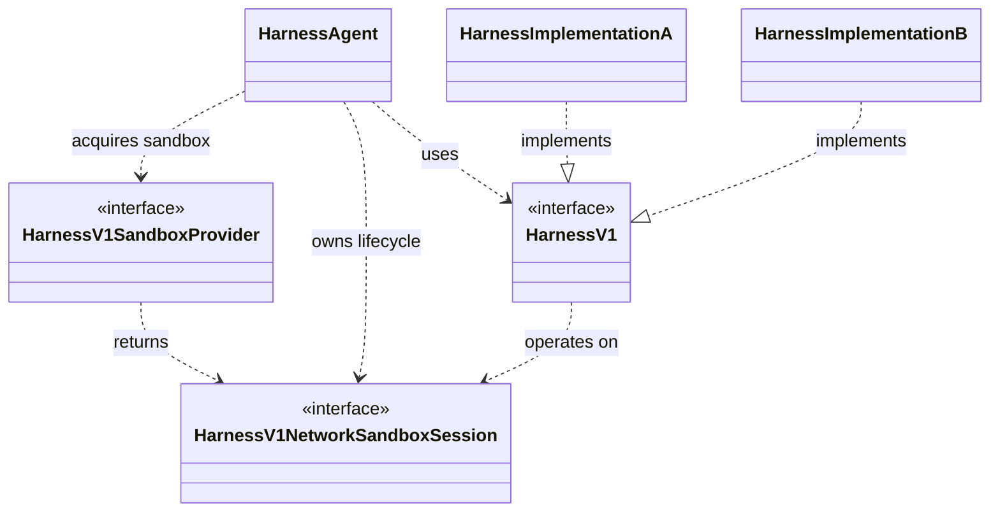
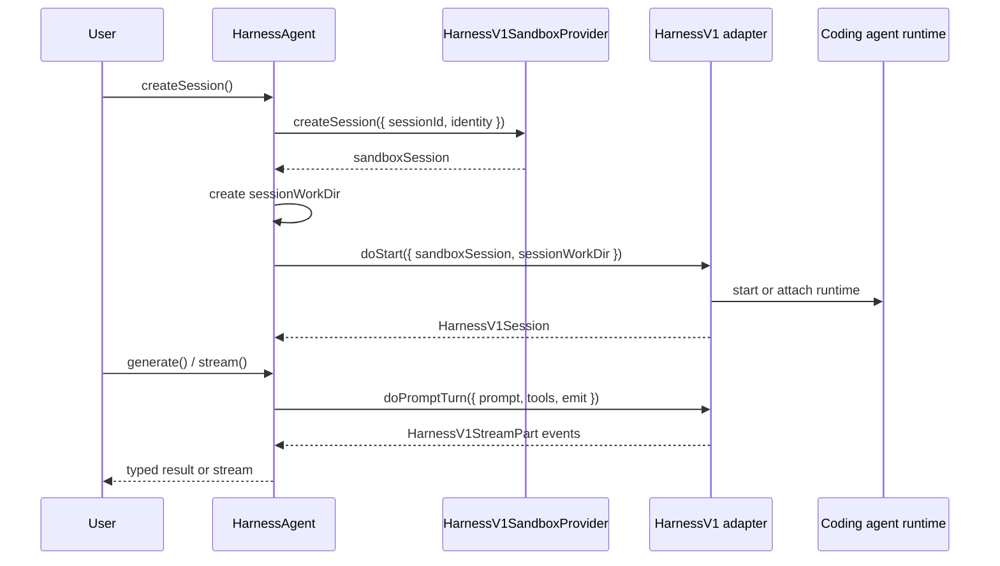

# Harness Abstraction Architecture

This document explains how the harness specification, sandbox providers, and harness adapter implementations connect in the AI SDK.
It starts with a high-level view and then describes the main decisions involved in adding a new harness adapter.

## High-Level Architecture

- **Harness agent**: user-facing agent runtime wrapper (`HarnessAgent`)
- **Harness specification**: `HarnessV1`
- **Sandbox provider**: `HarnessV1SandboxProvider`
- **Sandbox session**: `HarnessV1NetworkSandboxSession`, narrowed to `Experimental_SandboxSession` via `restricted()`
- **Harness implementations**: provider-specific coding-agent adapters that implement `HarnessV1`

The key boundary is that `HarnessAgent` owns the sandbox lifecycle, while the adapter owns the underlying coding-agent runtime.
`HarnessAgent` creates or resumes the sandbox through the configured `HarnessV1SandboxProvider`, creates the per-session work directory, and then calls `HarnessV1.doStart()` with both the `sandboxSession` and `sessionWorkDir`.

The adapter must operate on that provided sandbox.

If an underlying runtime cannot be made to work against the sandbox supplied by the AI SDK harness framework, it is not suitable to be implemented as an AI SDK harness.

The adapter is the translation boundary between the native coding-agent runtime and the harness protocol.
It should expose native runtime output, tool calls, approvals, completion, and usage through the harness stream and control surfaces without leaking runtime-specific protocol details into `HarnessAgent`.

## Harness Interfaces

- `HarnessV1` - [`packages/harness/src/v1/harness-v1.ts`](../packages/harness/src/v1/harness-v1.ts)
  - Describes one harness adapter.
  - Exposes a stable `harnessId`, built-in tool metadata, optional bootstrap recipe, optional lifecycle state schema, and `doStart()`.
- `HarnessV1Session` - [`packages/harness/src/v1/harness-v1-session.ts`](../packages/harness/src/v1/harness-v1-session.ts)
  - Represents one active harness session.
  - Handles prompt turns, continued turns, compaction, suspension, detach, stop, and destroy.

`HarnessV1SandboxProvider` and `HarnessV1NetworkSandboxSession` are part of the overall architecture, but they are sandbox contracts rather than harness adapter contracts.

A harness implementer consumes the `sandboxSession` that `HarnessAgent` passes to `doStart()`; they do not implement the sandbox provider or sandbox session interfaces.

## Adapter Runtime Placement

A harness adapter can be implemented in two broad shapes.

### Host-Driven Runtime

The preferred shape is a host-resident adapter that runs in the host Node.js process and uses the sandbox only as the workspace, filesystem, and shell target.
A host-driven harness implementation follows this approach:

- the agent runtime is created on the host,
- remote filesystem and shell operations are translated to `sandboxSession` calls,
- no bridge process is installed in the sandbox,
- no sandbox port is required.

If a harness adapter can be implemented so that it runs on the host and only operates on the sandbox, that is the preferable setup.
It keeps the sandbox smaller, avoids long-lived bridge transport, avoids port requirements, and makes credentials easier to keep on the host.

### Bridge-Backed Runtime

Some runtimes need to execute inside the sandbox because their SDK or CLI assumes local access to the working directory, local process state, or a runtime-specific home directory.
A bridge-backed harness implementation follows this approach:

- the adapter declares or applies bootstrap files for an in-sandbox bridge,
- the sandbox exposes a port,
- the host connects to the bridge over the sandbox-proxied port,
- the bridge drives the native SDK or CLI inside the sandbox,
- the adapter maps bridge messages to `HarnessV1StreamPart` events.

Bridge-backed adapters are valid when required by the underlying runtime. If so, the bridge must be installed in the sandbox and all interactions to the harness must happen through the bridge communication protocol.

## Filesystem Boundaries

Treat `sessionWorkDir` as the user's session workspace.
Files that the user or runtime is expected to inspect, edit, or preserve as part of the working tree belong there.
Harness infrastructure does not.

Adapter-owned infrastructure should live in adapter-owned locations:

- bridge code, package installs, and marker files belong under the adapter bootstrap directory, such as `/tmp/harness/<harness-id>`;
- runtime discovery files belong under the runtime's home/config directory, such as `$HOME/.agents/skills`;
- bridge state should live in a separate adapter state directory, not as user-visible project content.

Do not write harness infrastructure into `sessionWorkDir`. For example, do not put harness-provided skills in `workdir/.agents/skills`, but place them in `$HOME/.agents/skills` instead.

## Authentication

Harness adapters should support flexible authentication options instead of assuming one provider-specific environment variable.
Prefer auth that can work with explicit adapter settings, host environment variables, AI Gateway, and OIDC tokens such as `VERCEL_OIDC_TOKEN`.
OIDC-backed auth is especially useful because it avoids long-lived static secrets.

Resolve credentials on the host when possible, pass only what the runtime needs, and never persist secrets in `sessionWorkDir` or lifecycle state.

## Lifecycle and Resume

A harness distinguishes between resuming a session and continuing a turn.

**Resume a session** means re-opening an existing harness session before starting the next user turn.
The previous turn is already complete, so the adapter only needs enough state to restore the runtime's conversation, workspace, and configuration.

**Continue a turn** means recovering an in-flight turn that was interrupted after work had already started.
The adapter must resume from a precise point in the active turn when possible.
Bridge-backed adapters may be able to attach to a live runtime and replay buffered events; host-driven adapters may need to persist state and re-drive part of the work.

Adapters should return lifecycle payloads that are small, serializable, and specific to their `harnessId`.
If the payload has meaningful structure, expose `lifecycleStateSchema` so imported state can be validated before use.
