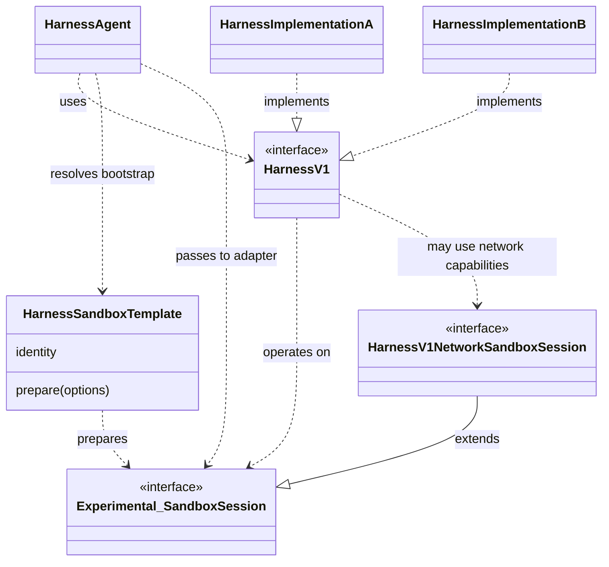
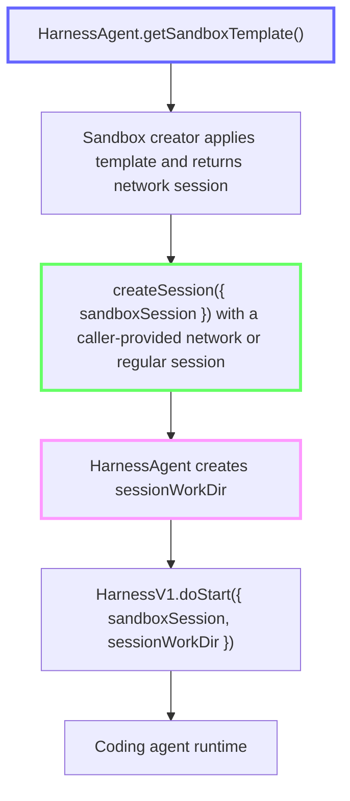
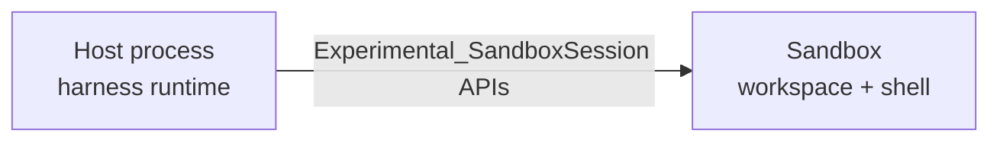
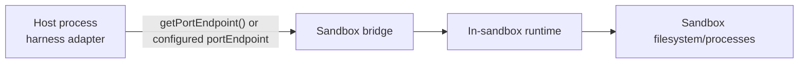

# Harness abstraction architecture

This document explains how harness agents, sandbox sessions, and harness adapters fit together in the AI SDK.
It starts with a high-level view and then describes the main decisions involved in adding a new harness adapter.

## High-level architecture

- **Harness agent**: user-facing agent runtime wrapper (`HarnessAgent`)
- **Harness specification**: `HarnessV1`
- **Sandbox template**: `HarnessSandboxTemplate`, prepared by a sandbox session creator before a live session starts
- **Sandbox session**: either `HarnessV1NetworkSandboxSession` (recommended) or the narrower `Experimental_SandboxSession`
- **Harness implementations**: provider-specific coding-agent adapters that implement `HarnessV1`

```mermaid
classDiagram
    class HarnessAgent
    class HarnessV1 {
      <<interface>>
    }
    class HarnessSandboxTemplate {
      identity
      prepare(options)
    }
    class HarnessV1NetworkSandboxSession {
      <<interface>>
    }
    class Experimental_SandboxSession {
      <<interface>>
    }
    class HarnessImplementationA
    class HarnessImplementationB

    HarnessAgent ..> HarnessV1 : uses
    HarnessAgent ..> HarnessSandboxTemplate : resolves bootstrap
    HarnessSandboxTemplate ..> Experimental_SandboxSession : prepares
    HarnessV1NetworkSandboxSession --|> Experimental_SandboxSession : extends
    HarnessAgent ..> Experimental_SandboxSession : passes to adapter
    HarnessV1 ..> Experimental_SandboxSession : operates on
    HarnessV1 ..> HarnessV1NetworkSandboxSession : may use network capabilities
    HarnessImplementationA ..|> HarnessV1 : implements
    HarnessImplementationB ..|> HarnessV1 : implements
```

The caller creates or reattaches a sandbox session and passes it to `HarnessAgent.createSession({ sandboxSession })`.
It then creates the per-session work directory and calls `HarnessV1.doStart()` with both the `sandboxSession` and `sessionWorkDir`.
Sandbox provisioning and lifecycle behavior are described in [Sandbox ownership and lifecycle](#sandbox-ownership-and-lifecycle).

The adapter must operate on that provided sandbox.

If an underlying runtime cannot be made to work against the sandbox supplied by the AI SDK harness framework, it is not suitable to be implemented as an AI SDK harness.

The adapter is the translation boundary between the native coding-agent runtime and the harness protocol.
It should expose native runtime output, tool calls, approvals, completion, and usage through the harness stream and control surfaces without leaking runtime-specific protocol details into `HarnessAgent`.

## Harness interfaces

- `HarnessV1` - [`packages/harness/src/v1/harness-v1.ts`](../packages/harness/src/v1/harness-v1.ts)
  - Describes one harness adapter.
  - Exposes a stable `harnessId`, built-in tool metadata, optional bootstrap recipe, optional lifecycle state schema, and `doStart()`.
- `HarnessV1Session` - [`packages/harness/src/v1/harness-v1-session.ts`](../packages/harness/src/v1/harness-v1-session.ts)
  - Represents one active harness session.
  - Handles prompt turns, continued turns, compaction, suspension, detach, stop, and destroy.

`HarnessSandboxTemplate` is the agent-layer alias of the sandbox contract `HarnessV1SandboxTemplate`. It and `HarnessV1NetworkSandboxSession` are sandbox contracts rather than harness adapter contracts. To implement a sandbox that supports the harness layer, see the [sandbox abstraction architecture doc](./sandbox-abstraction.md).

A harness implementer consumes the `sandboxSession` that `HarnessAgent` passes to `doStart()`; they do not implement sandbox session interfaces.

## Sandbox ownership and lifecycle

Pass a `HarnessV1NetworkSandboxSession` to `createSession({ sandboxSession })` when an adapter needs ports or network policy. A basic `Experimental_SandboxSession` is sufficient for adapters that do not need network ports to communicate with an in-sandbox process. To resume, reattach the native sandbox and supply its adapted session together with the harness lifecycle state.

Passing `sandboxSession` directly always leaves its lifecycle with the caller, regardless of which sandbox session interface it implements.
`HarnessAgent` does not stop or destroy a caller-provided sandbox.

### With a supplied sandbox

- `session.detach()`: Calls adapter `doDetach()`, or `doSuspendTurn()` for an unfinished turn; leaves the sandbox unchanged.
- `session.stop()`: Calls adapter `doStop()`, or `doSuspendTurn()` for an unfinished turn; leaves the sandbox unchanged.
- `session.destroy()`: Calls adapter `doDestroy()`; leaves the sandbox unchanged.

Explicit calls to `sandboxSession.stop()` or `sandboxSession.destroy()` on a network adaptation still operate on the native sandbox. These methods are not called by `HarnessAgentSession` when the sandbox session was supplied by the caller, including when startup fails.

The adapter never owns the sandbox lifecycle.
It receives the selected sandbox session through `HarnessV1.doStart()` and must not stop or destroy it.

```mermaid
flowchart TD
    Template["HarnessAgent.getSandboxTemplate()"]
    Creator["Sandbox creator applies template and returns network session"]
    ProvidedCall["createSession({ sandboxSession }) with a caller-provided network or regular session"]
    Setup["HarnessAgent creates sessionWorkDir"]
    Adapter["HarnessV1.doStart({ sandboxSession, sessionWorkDir })"]
    Runtime["Coding agent runtime"]

    Template --> Creator
    Creator --> ProvidedCall
    ProvidedCall --> Setup
    Setup --> Adapter
    Adapter --> Runtime

    style Template stroke:#66f,stroke-width:3px
    style ProvidedCall stroke:#6f6,stroke-width:3px
    style Setup stroke:#f9f,stroke-width:3px
```

## Adapter runtime placement

A harness adapter can be implemented in two broad shapes.

### Host-driven runtime

The preferred shape is a host-resident adapter that runs in the host Node.js process and uses the sandbox only as the workspace, filesystem, and shell target.
A host-driven harness implementation follows this approach:

- the agent runtime is created on the host,
- remote filesystem and shell operations are translated to `sandboxSession` calls,
- no bridge process is installed in the sandbox,
- no sandbox port is required.

If a harness adapter can be implemented so that it runs on the host and only operates on the sandbox, that is the preferable setup.
It keeps the sandbox smaller, avoids long-lived bridge transport, avoids port requirements, and makes credentials easier to keep on the host.

### Bridge-backed runtime

Some runtimes need to execute inside the sandbox because their SDK or CLI assumes local access to the working directory, local process state, or a runtime-specific home directory.
This is only necessary when those assumptions cannot be adapted at the host boundary.
A bridge-backed harness implementation follows this approach:

- the adapter declares or applies bootstrap files for an in-sandbox bridge,
- the bridge binds to a TCP port inside the sandbox,
- the host connects to the bridge through an endpoint that routes to that port,
- the bridge drives the native SDK or CLI inside the sandbox,
- the adapter maps bridge messages to `HarnessV1StreamPart` events.

Bridge-backed adapters are valid when required by the underlying runtime. If so, the bridge must be installed in the sandbox and all interactions to the harness must happen through the bridge communication protocol.

Prefer passing a `HarnessV1NetworkSandboxSession` to a bridge-backed adapter.
The adapter can obtain the sandbox's declared ports and resolve the selected port through `getPortEndpoint()`.

A bridge-backed adapter can alternatively use a regular `Experimental_SandboxSession` when both `port` and `portEndpoint` are passed to the harness adapter's constructor.
In that configuration, the caller is responsible for ensuring that `portEndpoint` routes to the bridge's in-sandbox `port`.
This setup is less preferable because the connection details live outside the sandbox session contract, but it supports environments that cannot provide a full `HarnessV1NetworkSandboxSession`.

## Harness and sandbox interaction

Ideally, the harness runtime runs in the host environment and operates exclusively on the sandbox session passed to it by `HarnessAgent`.

```mermaid
flowchart LR
    Host["Host process\nharness runtime"]
    Sandbox["Sandbox\nworkspace + shell"]

    Host -->|"Experimental_SandboxSession APIs"| Sandbox
```

In practice, many coding-agent runtimes cannot run this way.
If the runtime SDK or CLI needs local workspace access, local process state, or a runtime-specific home directory, the harness must run inside the sandbox and use bridge mode for host communication.

```mermaid
flowchart LR
    Host["Host process\nharness adapter"]
    Bridge["Sandbox bridge"]
    Runtime["In-sandbox runtime"]
    Sandbox["Sandbox filesystem/processes"]

    Host -->|"getPortEndpoint() or configured portEndpoint"| Bridge
    Bridge --> Runtime
    Runtime --> Sandbox
```

Bridge-backed harnesses must bootstrap the sandbox that is passed to them.
That bootstrap must be declared as a [`HarnessV1Bootstrap`](../packages/harness/src/v1/harness-v1-bootstrap.ts) recipe so the agent and sandbox templates can apply it consistently.

Call `agent.getSandboxTemplate()` for one adapter, or pass the same `sandboxConfig` you gave the `agent` to `createHarnessSandboxTemplate({ harnesses, sandboxConfig })`, to prepare the sandbox template for multiple harness adapters. Both resolve recipes and a deterministic aggregate identity before returning. A sandbox creator calls `template.prepare({ session, abortSignal })` on a basic session, then persists the prepared filesystem when its SDK supports snapshots. A creator with no snapshot support prepares every fresh sandbox.

The identity includes normalized `workDir`, `bootstrapHash`, and sorted harness recipe identities. The caller changes `bootstrapHash` when the bootstrap hook's side effects change. Recipe and successful-hook markers live under the sandbox's HOME, separate from the session work directory. `onSession` runs each time the agent acquires a session, not during template preparation.

## Filesystem boundaries

Treat `sessionWorkDir` as the user's session workspace.
Files that the user or runtime is expected to inspect, edit, or preserve as part of the working tree belong there.
Harness infrastructure does not.

Adapter-owned infrastructure should live in adapter-owned locations:

- bridge code, package installs, and marker files belong under the adapter bootstrap directory, such as `/tmp/harness/<harness-id>`;
- runtime discovery files belong under the runtime's home/config directory, such as `$HOME/.agents/skills`;
- bridge state should live in a separate adapter state directory, not as user-visible project content.

Do not write harness infrastructure into `sessionWorkDir`. For example, do not put harness-provided skills in `workdir/.agents/skills`, but place them in `$HOME/.agents/skills` instead.

## Authentication

Harness adapters should support flexible authentication options instead of assuming one provider-specific environment variable.
Prefer auth that can work with explicit adapter settings, host environment variables, AI Gateway, and OIDC tokens such as `VERCEL_OIDC_TOKEN`.
OIDC-backed auth is especially useful because it avoids long-lived static secrets.

Some adapters can resolve credentials from the runtime's native subscription on the host.
These adapters use native subscription credentials only when no applicable Gateway or direct credential is available. The `ai-gateway` mode and an `auth` environment object do not read native subscriptions.

### Credential handling

Model and provider credentials must not enter the sandbox.

- Host-driven adapters keep model and provider credentials on the host. Prefer this setup when the runtime can run on the host.
- Bridge-backed adapters should use credential brokering so the sandbox process receives only non-secret placeholders.

The exception is per-session bridge authentication tokens, which bridge-backed adapters need inside the sandbox.

Credential brokering requires a `HarnessV1NetworkSandboxSession` implementation with `addRequestTransformations()` and is strongly recommended. The adapter installs outbound HTTPS request transformations that match the placeholder and destination, then inject the real credential after the request leaves the sandbox security boundary.

When `addRequestTransformations()` is unavailable, adapters fall back to forwarding authentication values into the sandbox process. This is the only supported case in which real model or provider credentials may enter the sandbox. The adapter warns if a real credential remains in the forwarded environment. It does not warn if `credentialForwarding` replaces every real credential with a caller-managed value.

The optional `credentialForwarding` adapter setting provides advanced control over each value before it enters the sandbox. It receives a non-secret placeholder when credential brokering is available and the real credential otherwise; its return value is what the sandbox process receives. It does not restrict which credentials the adapter can discover or access on the host.

You can use the `credentialForwarding` setting if you handle credential brokering on your own, for example when passing a regular `Experimental_SandboxSession` (which lacks `addRequestTransformations()`) to `agent.createSession()`:

- `credentialForwarding` allows you to inject custom placeholder credentials into the sandbox instead of the real credentials from environment variables.
- Alternatively, provide placeholder credentials in the environment variables themselves.

Never persist secrets in `sessionWorkDir`. Lifecycle state can contain bridge tokens or forwarded credentials, so callers must treat it as sensitive data and store and transmit it securely.

## Lifecycle and resume

A harness distinguishes between resuming a session and continuing a turn.

- **Resume a session** means re-opening an existing harness session from `resumeFrom`.
  The resume state may represent a between-turn handoff or include a nested `continueFrom` for an unfinished turn.
  When `continueFrom` is present, that turn must be continued before a new user turn can begin (see below).
- **Continue a turn** means recovering an in-flight turn that was interrupted after work had already started.
  The adapter must continue from a precise point in the active turn when possible.
  Bridge-backed adapters may be able to attach to a live runtime and replay buffered events; host-driven adapters may need to persist state and re-drive part of the work.

The adapter's `doSuspendTurn()` returns `continueFrom`, which `session.suspendTurn()` exposes directly. When `session.detach()` or `session.stop()` ends an in-flight turn, `HarnessAgent` constructs and returns `resumeFrom` containing that `continueFrom` state.

Adapters should return lifecycle payloads that are small, serializable, and specific to their `harnessId`.
If the payload has meaningful structure, expose `lifecycleStateSchema` so imported state can be validated before use.

In the harness abstraction layer, use `resume` only for sessions and `continue` only for turns.
