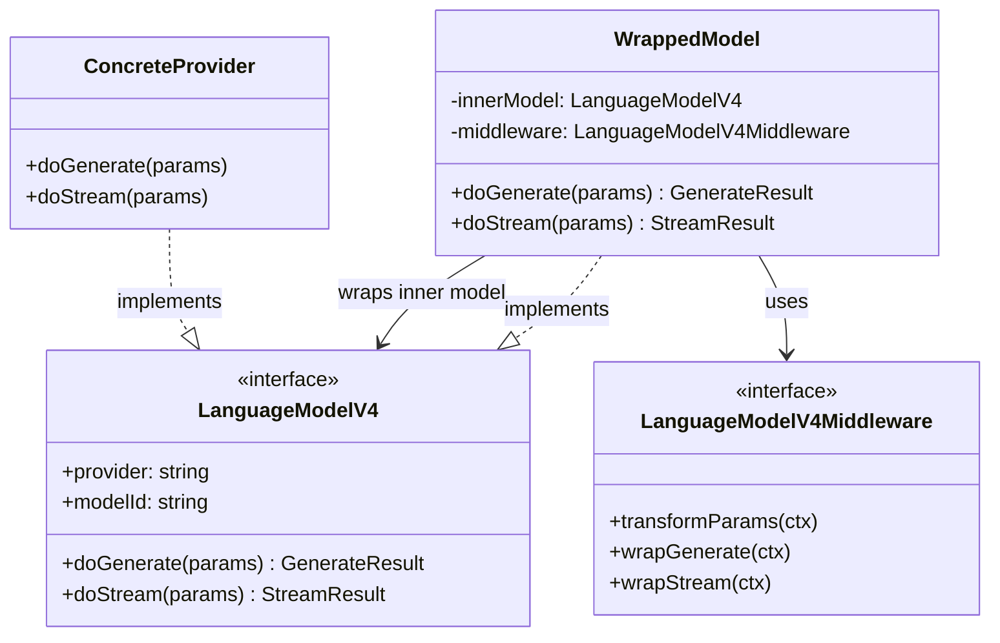
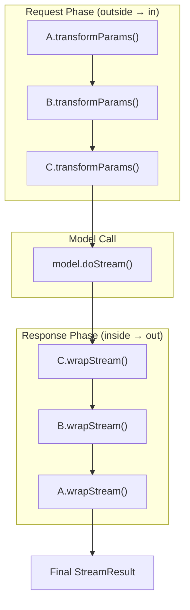
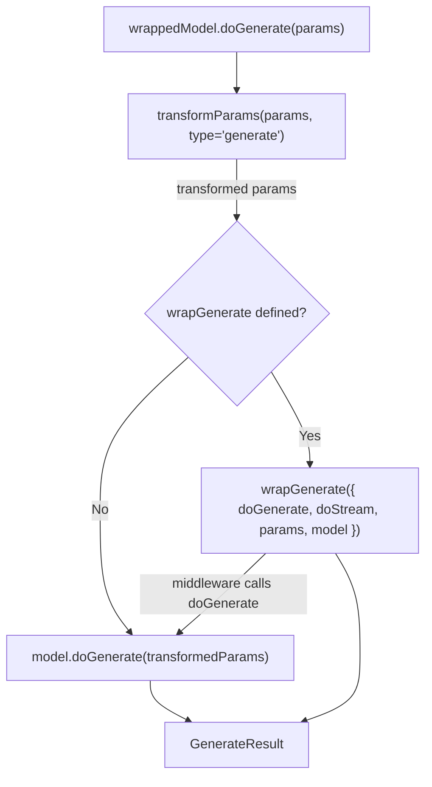
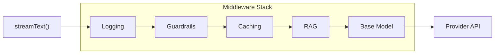
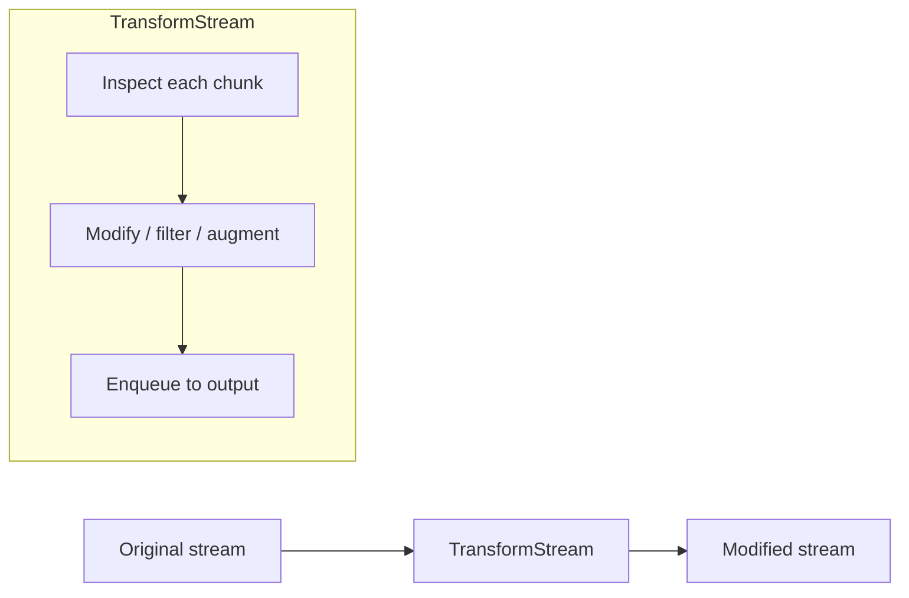

# Middleware Pipeline Architecture

This document details how language model middleware works internally, covering the wrapping mechanism, execution order, and composition patterns.

## Wrapping Mechanism

`wrapLanguageModel()` takes a model and one or more middlewares, returning a new `LanguageModelV4` that intercepts `doGenerate` and `doStream` calls.



The wrapped model satisfies the same `LanguageModelV4` interface, so it can be used anywhere a model is expected — including as input to another `wrapLanguageModel()` call.

## Composition and Execution Order

When an array of middlewares `[A, B, C]` is provided, the SDK reverses the array and reduces from the innermost wrapper outward:

```
wrapLanguageModel({ model, middleware: [A, B, C] })

// Internally becomes:
A( B( C( model ) ) )
```

This means:

- **Parameter transforms** execute outside-in: A first, then B, then C
- **Stream/generate wrappers** execute outside-in for the "before" phase: A wraps B wraps C wraps model
- **Results** flow back inside-out: model result passes through C, then B, then A



## Internal Call Flow

For each `doGenerate` or `doStream` call on a wrapped model:



The `wrapGenerate` and `wrapStream` callbacks receive both `doGenerate` and `doStream` functions, allowing a stream wrapper to fall back to non-streaming generation (or vice versa) if needed.

## Middleware Hook Reference

| Hook | Signature | Called During | Typical Uses |
|------|-----------|--------------|-------------|
| `transformParams` | `(ctx: { params, type, model }) => params` | Both generate and stream | Inject RAG context, rewrite prompts, add system instructions |
| `wrapGenerate` | `(ctx: { doGenerate, doStream, params, model }) => result` | `doGenerate` only | Caching responses, applying guardrails, logging |
| `wrapStream` | `(ctx: { doGenerate, doStream, params, model }) => result` | `doStream` only | Stream transforms, token counting, rate monitoring |
| `overrideProvider` | `(ctx: { model }) => string` | Model construction | Dynamic provider routing |
| `overrideModelId` | `(ctx: { model }) => string` | Model construction | Model aliasing, A/B testing |
| `overrideSupportedUrls` | `(ctx: { model }) => urls` | Model construction | URL allowlist overrides |

## Common Patterns

### Layered Middleware Stack

A typical production setup layers concerns:



Each middleware handles one concern. The logging middleware records inputs and outputs. The guardrail middleware validates content. The caching middleware short-circuits repeated queries. The RAG middleware injects retrieved context into the prompt.

### Stream Transformation

Middleware can modify stream content by piping through a `TransformStream`:



The `wrapStream` hook receives the original stream and can return a new stream that pipes through any number of transforms. This is how built-in middlewares like `extractReasoningMiddleware` parse reasoning tags from the text stream and re-emit them as structured reasoning parts.
