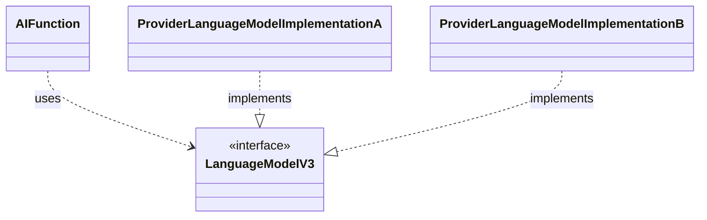
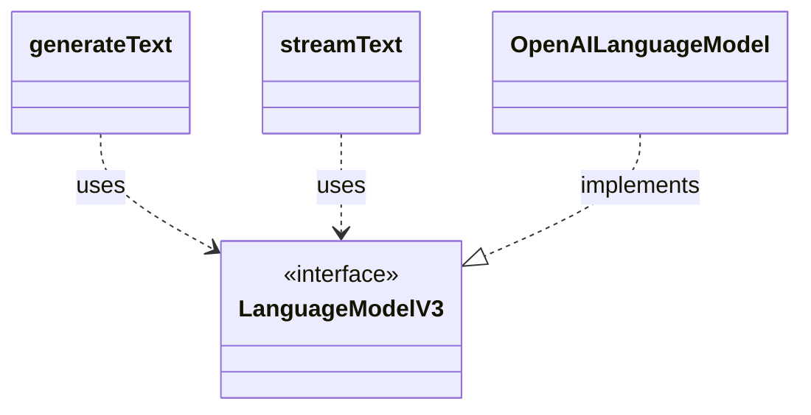
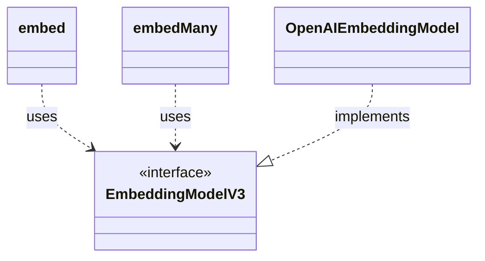
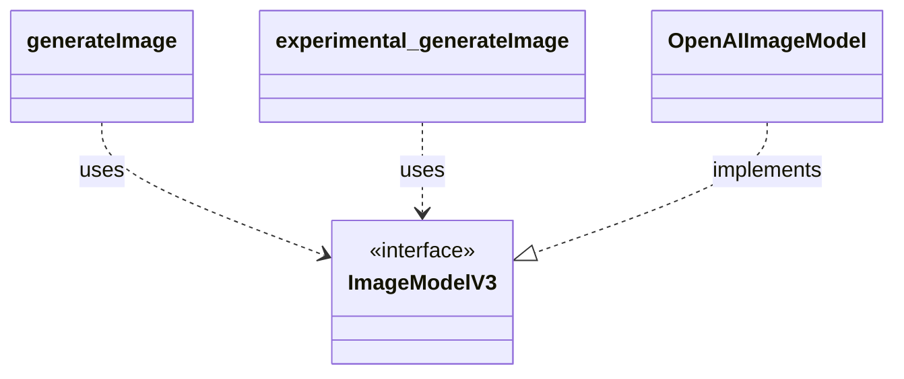
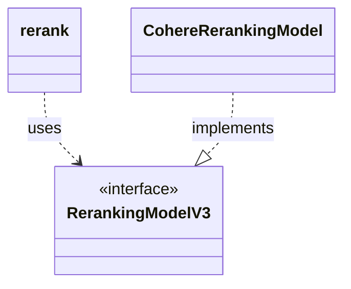
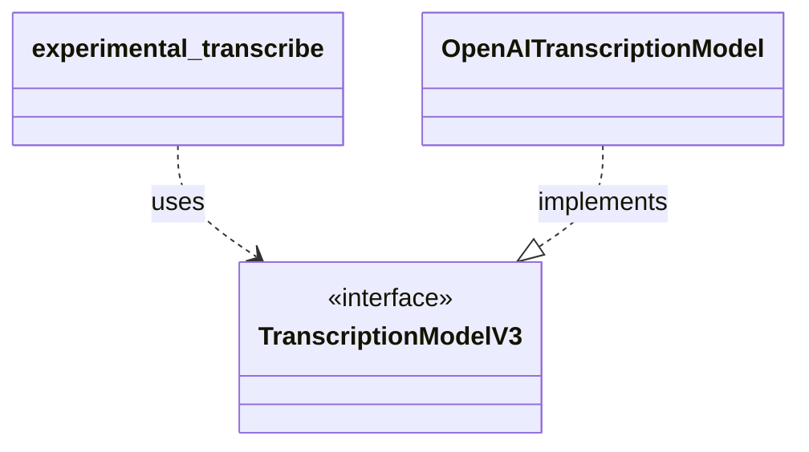
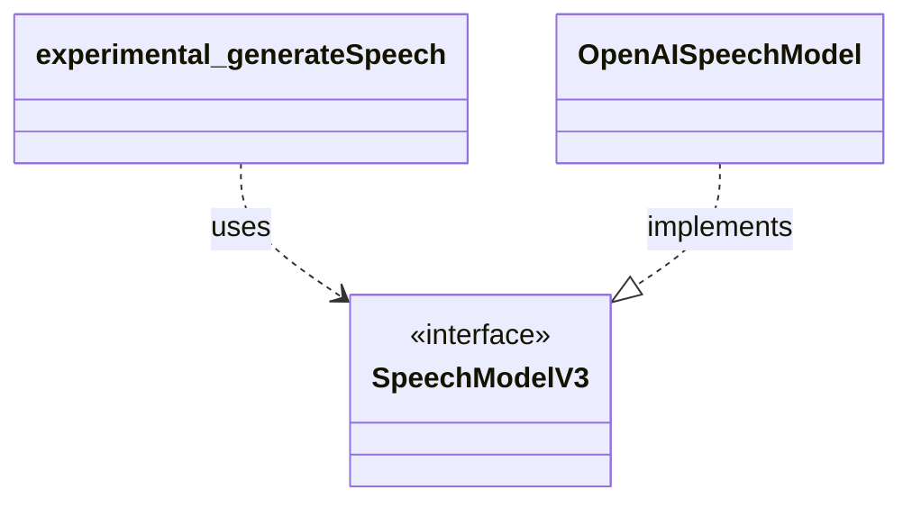
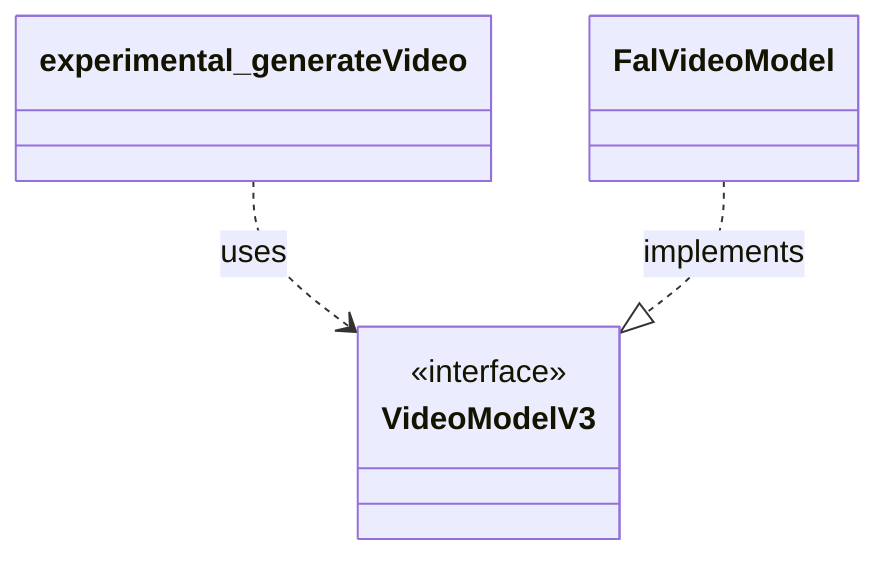

# Provider Abstraction Architecture

This document explains how AI functions, model specifications, and provider implementations connect in the AI SDK.
It starts with an abstract high-level view and then details each V3 model type, including the AI functions that use it and small UML diagrams.

## High-Level Architecture

- **AI functions**: user-facing language functions (for example, `streamText`)
- **Model specification**: `LanguageModelV3`
- **Provider implementations**: provider-specific language model implementations of `LanguageModelV3`

## Model-Type Details

### Language Model (`LanguageModelV3`)

Language models are used for text generation and structured generation workflows from prompt or message input.

- **AI functions**
  - `generateText` - [`packages/ai/src/generate-text/generate-text.ts`](packages/ai/src/generate-text/generate-text.ts) - Generates a complete text result from a language model in a single call.
  - `streamText` - [`packages/ai/src/generate-text/stream-text.ts`](packages/ai/src/generate-text/stream-text.ts) - Streams language model output incrementally as it is produced.
  - `generateObject` - [`packages/ai/src/generate-object/generate-object.ts`](packages/ai/src/generate-object/generate-object.ts) - Generates one structured object from a language model according to a schema.
  - `streamObject` - [`packages/ai/src/generate-object/stream-object.ts`](packages/ai/src/generate-object/stream-object.ts) - Streams partial structured object output from a language model over time.
- **Model specification**
  - `LanguageModelV3` - [`packages/provider/src/language-model/v3/language-model-v3.ts`](packages/provider/src/language-model/v3/language-model-v3.ts)
- **Provider implementations (examples)**
  - `OpenAILanguageModel`, `AnthropicLanguageModel`

### Embedding Model (`EmbeddingModelV3`)

Embedding models are used to convert text into numeric vectors for similarity and retrieval use cases.

- **AI functions**
  - `embed` - [`packages/ai/src/embed/embed.ts`](packages/ai/src/embed/embed.ts) - Creates a single embedding vector for one text value.
  - `embedMany` - [`packages/ai/src/embed/embed-many.ts`](packages/ai/src/embed/embed-many.ts) - Creates embedding vectors for multiple text values, batching calls when needed.
- **Model specification**
  - `EmbeddingModelV3` - [`packages/provider/src/embedding-model/v3/embedding-model-v3.ts`](packages/provider/src/embedding-model/v3/embedding-model-v3.ts)
- **Provider implementations (examples)**
  - `OpenAIEmbeddingModel`, `MistralEmbeddingModel`

### Image Model (`ImageModelV3`)

Image models are used to generate image outputs from text prompts.

- **AI functions**
  - `generateImage` - [`packages/ai/src/generate-image/generate-image.ts`](packages/ai/src/generate-image/generate-image.ts) - Generates one or more images from prompt input.
  - `experimental_generateImage` - [`packages/ai/src/generate-image/generate-image.ts`](packages/ai/src/generate-image/generate-image.ts) - Provides the deprecated experimental alias for `generateImage`.
- **Model specification**
  - `ImageModelV3` - [`packages/provider/src/image-model/v3/image-model-v3.ts`](packages/provider/src/image-model/v3/image-model-v3.ts)
- **Provider implementations (examples)**
  - `OpenAIImageModel`, `GoogleImageModel`

### Reranking Model (`RerankingModelV3`)

Reranking models are used to reorder candidate documents by relevance to a query.

- **AI functions**
  - `rerank` - [`packages/ai/src/rerank/rerank.ts`](packages/ai/src/rerank/rerank.ts) - Reorders documents and returns a relevance-ranked result set for a query.
- **Model specification**
  - `RerankingModelV3` - [`packages/provider/src/reranking-model/v3/reranking-model-v3.ts`](packages/provider/src/reranking-model/v3/reranking-model-v3.ts)
- **Provider implementations (examples)**
  - `CohereRerankingModel`, `VertexRerankingModel`

### Transcription Model (`TranscriptionModelV3`)

Transcription models are used to convert audio input into text transcripts.

- **AI functions**
  - `experimental_transcribe` - [`packages/ai/src/transcribe/transcribe.ts`](packages/ai/src/transcribe/transcribe.ts) - Transcribes audio into text with segment and metadata support.
- **Model specification**
  - `TranscriptionModelV3` - [`packages/provider/src/transcription-model/v3/transcription-model-v3.ts`](packages/provider/src/transcription-model/v3/transcription-model-v3.ts)
- **Provider implementations (examples)**
  - `OpenAITranscriptionModel`, `DeepgramTranscriptionModel`

### Speech Model (`SpeechModelV3`)

Speech models are used to synthesize audio from text input.

- **AI functions**
  - `experimental_generateSpeech` - [`packages/ai/src/generate-speech/generate-speech.ts`](packages/ai/src/generate-speech/generate-speech.ts) - Generates speech audio from text input.
- **Model specification**
  - `SpeechModelV3` - [`packages/provider/src/speech-model/v3/speech-model-v3.ts`](packages/provider/src/speech-model/v3/speech-model-v3.ts)
- **Provider implementations (examples)**
  - `OpenAISpeechModel`, `ElevenLabsSpeechModel`

### Video Model (`VideoModelV3`)

Video models are used to generate video outputs from prompts.

- **AI functions**
  - `experimental_generateVideo` - [`packages/ai/src/generate-video/generate-video.ts`](packages/ai/src/generate-video/generate-video.ts) - Generates one or more videos from prompt input.
- **Model specification**
  - `VideoModelV3` - [`packages/provider/src/video-model/v3/video-model-v3.ts`](packages/provider/src/video-model/v3/video-model-v3.ts)
- **Provider implementations (examples)**
  - `FalVideoModel`, `ReplicateVideoModel`

