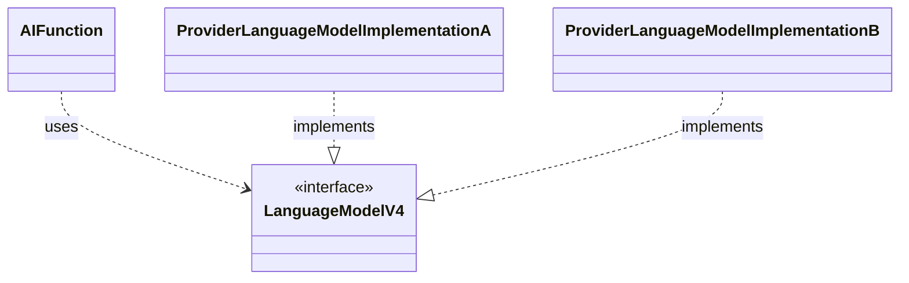
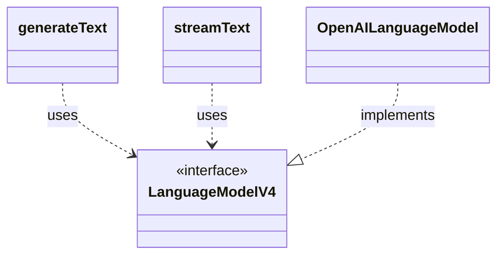
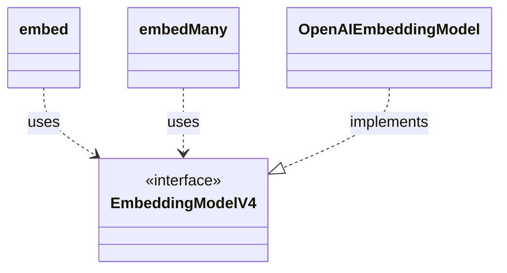
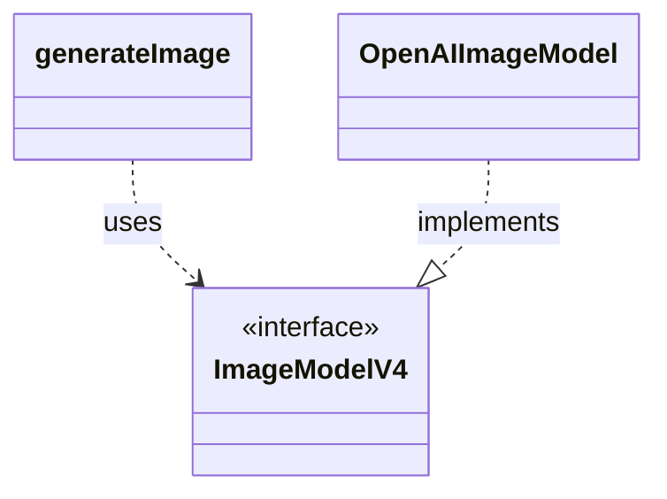
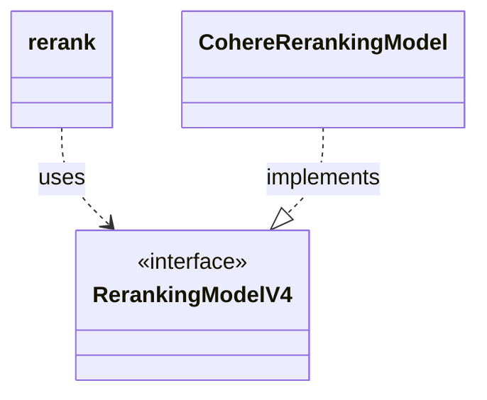
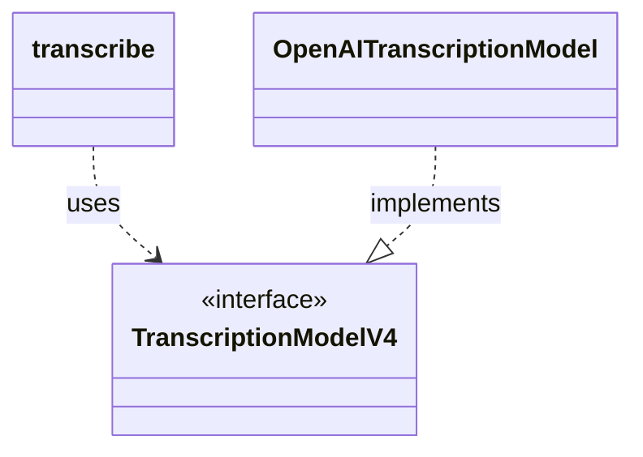
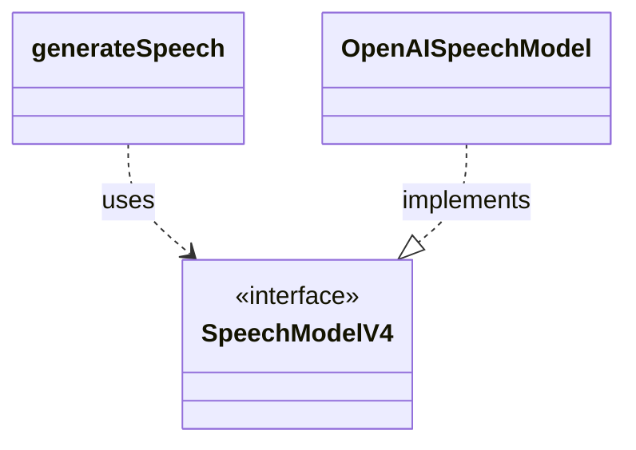
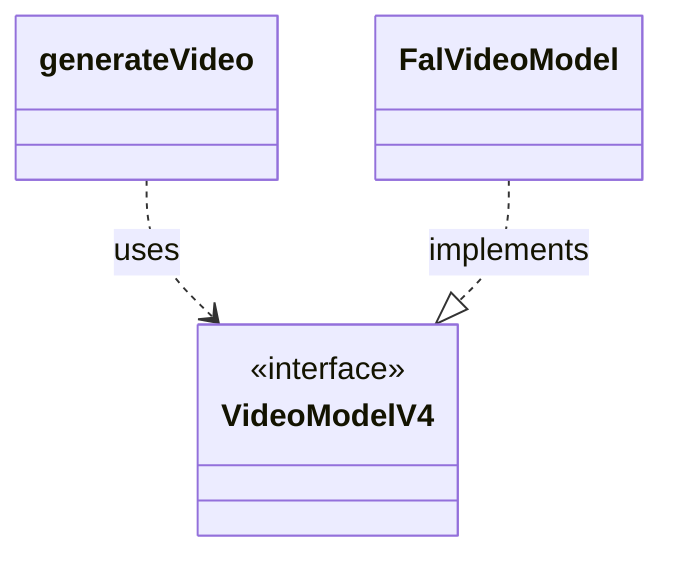

# Provider Abstraction Architecture

This document explains how AI functions, model specifications, and provider implementations connect in the AI SDK.
It starts with an abstract high-level view and then details each V4 model type, including the AI functions that use it and small UML diagrams.

## High-Level Architecture

- **AI functions**: user-facing language functions (for example, `streamText`)
- **Model specification**: `LanguageModelV4`
- **Provider implementations**: provider-specific language model implementations of `LanguageModelV4`

```mermaid
classDiagram
    class AIFunction
    class LanguageModelV4 {
      <<interface>>
    }
    class ProviderLanguageModelImplementationA
    class ProviderLanguageModelImplementationB

    AIFunction ..> LanguageModelV4 : uses
    ProviderLanguageModelImplementationA ..|> LanguageModelV4 : implements
    ProviderLanguageModelImplementationB ..|> LanguageModelV4 : implements
```

## Model-Type Details

If you're unable to find any of the functions mentioned below in the codebase, they may only exist with an `experimental_` prefix. This means they're experimental, and stable versions will likely be implemented at a later point.

### Language Model (`LanguageModelV4`)

Language models are used for text generation and structured generation workflows from prompt or message input.

- **AI functions**
  - `generateText` - [`packages/ai/src/generate-text/generate-text.ts`](packages/ai/src/generate-text/generate-text.ts) - Generates a complete text result from a language model in a single call.
  - `streamText` - [`packages/ai/src/generate-text/stream-text.ts`](packages/ai/src/generate-text/stream-text.ts) - Streams language model output incrementally as it is produced.
- **Model specification**
  - `LanguageModelV4` - [`packages/provider/src/language-model/v4/language-model-v4.ts`](packages/provider/src/language-model/v4/language-model-v4.ts)
- **Provider implementations (examples)**
  - [`OpenAIChatLanguageModel`](packages/openai/src/chat/openai-chat-language-model.ts), [`AnthropicLanguageModel`](packages/anthropic/src/anthropic-language-model.ts)

```mermaid
classDiagram
    class generateText
    class streamText
    class LanguageModelV4 {
      <<interface>>
    }
    class OpenAILanguageModel

    generateText ..> LanguageModelV4 : uses
    streamText ..> LanguageModelV4 : uses
    OpenAILanguageModel ..|> LanguageModelV4 : implements
```

#### Handling the `reasoning` Parameter

The `reasoning` field on [`LanguageModelV4CallOptions`](packages/provider/src/language-model/v4/language-model-v4-call-options.ts) controls how much reasoning a model performs before responding. Possible values: `'provider-default'`, `'none'`, `'minimal'`, `'low'`, `'medium'`, `'high'`, `'xhigh'`.

Use `isCustomReasoning(reasoning)` from `@ai-sdk/provider-utils` to check whether the caller supplied a custom value (anything other than `undefined` or `'provider-default'`). If it returns `false`, no action is needed. If `true`:

1. **`'none'`** — Disable reasoning. Only some providers support this; others should emit an unsupported warning.
2. **Any other value** — Map it to the provider's native configuration using one of two strategies:
   - **Effort mapping** (use `mapReasoningToProviderEffort`): Maps the spec enum to a provider-specific effort string via an `effortMap`. If the exact level has no provider equivalent, coerce to the next lower level; if there is no lower level, coerce to the next higher one. Emits a compatibility warning when coercion occurs, or an unsupported warning if no mapping exists at all.
   - **Budget mapping** (use `mapReasoningToProviderBudget`): Maps the spec enum to an absolute token budget. Takes the model's maximum reasoning budget (or overall max output tokens if no separate reasoning limit exists), multiplies by a percentage for each level (defaults: minimal 2%, low 10%, medium 30%, high 60%, xhigh 90%), and clamps the result between `minReasoningBudget` (default 1024) and `maxReasoningBudget`. Custom percentages can be provided per provider.

Providers that do **not** support reasoning configuration at the API level should emit an unsupported warning when `isCustomReasoning` returns `true`.

### Embedding Model (`EmbeddingModelV4`)

Embedding models are used to convert text into numeric vectors for similarity and retrieval use cases.

- **AI functions**
  - `embed` - [`packages/ai/src/embed/embed.ts`](packages/ai/src/embed/embed.ts) - Creates a single embedding vector for one text value.
  - `embedMany` - [`packages/ai/src/embed/embed-many.ts`](packages/ai/src/embed/embed-many.ts) - Creates embedding vectors for multiple text values, batching calls when needed.
- **Model specification**
  - `EmbeddingModelV4` - [`packages/provider/src/embedding-model/v4/embedding-model-v4.ts`](packages/provider/src/embedding-model/v4/embedding-model-v4.ts)
- **Provider implementations (examples)**
  - [`OpenAIEmbeddingModel`](packages/openai/src/embedding/openai-embedding-model.ts), [`MistralEmbeddingModel`](packages/mistral/src/mistral-embedding-model.ts)

```mermaid
classDiagram
    class embed
    class embedMany
    class EmbeddingModelV4 {
      <<interface>>
    }
    class OpenAIEmbeddingModel

    embed ..> EmbeddingModelV4 : uses
    embedMany ..> EmbeddingModelV4 : uses
    OpenAIEmbeddingModel ..|> EmbeddingModelV4 : implements
```

### Image Model (`ImageModelV4`)

Image models are used to generate image outputs from text prompts.

- **AI functions**
  - `generateImage` - [`packages/ai/src/generate-image/generate-image.ts`](packages/ai/src/generate-image/generate-image.ts) - Generates one or more images from prompt input.
- **Model specification**
  - `ImageModelV4` - [`packages/provider/src/image-model/v4/image-model-v4.ts`](packages/provider/src/image-model/v4/image-model-v4.ts)
- **Provider implementations (examples)**
  - [`OpenAIImageModel`](packages/openai/src/image/openai-image-model.ts), [`GoogleImageModel`](packages/google/src/google-image-model.ts)

```mermaid
classDiagram
    class generateImage
    class ImageModelV4 {
      <<interface>>
    }
    class OpenAIImageModel

    generateImage ..> ImageModelV4 : uses
    OpenAIImageModel ..|> ImageModelV4 : implements
```

### Reranking Model (`RerankingModelV4`)

Reranking models are used to reorder candidate documents by relevance to a query.

- **AI functions**
  - `rerank` - [`packages/ai/src/rerank/rerank.ts`](packages/ai/src/rerank/rerank.ts) - Reorders documents and returns a relevance-ranked result set for a query.
- **Model specification**
  - `RerankingModelV4` - [`packages/provider/src/reranking-model/v4/reranking-model-v4.ts`](packages/provider/src/reranking-model/v4/reranking-model-v4.ts)
- **Provider implementations (examples)**
  - [`CohereRerankingModel`](packages/cohere/src/reranking/cohere-reranking-model.ts), [`BedrockRerankingModel`](packages/amazon-bedrock/src/reranking/bedrock-reranking-model.ts)

```mermaid
classDiagram
    class rerank
    class RerankingModelV4 {
      <<interface>>
    }
    class CohereRerankingModel

    rerank ..> RerankingModelV4 : uses
    CohereRerankingModel ..|> RerankingModelV4 : implements
```

### Transcription Model (`TranscriptionModelV4`)

Transcription models are used to convert audio input into text transcripts.

- **AI functions**
  - `transcribe` - [`packages/ai/src/transcribe/transcribe.ts`](packages/ai/src/transcribe/transcribe.ts) - Transcribes audio into text with segment and metadata support.
- **Model specification**
  - `TranscriptionModelV4` - [`packages/provider/src/transcription-model/v4/transcription-model-v4.ts`](packages/provider/src/transcription-model/v4/transcription-model-v4.ts)
- **Provider implementations (examples)**
  - [`OpenAITranscriptionModel`](packages/openai/src/transcription/openai-transcription-model.ts), [`DeepgramTranscriptionModel`](packages/deepgram/src/deepgram-transcription-model.ts)

```mermaid
classDiagram
    class transcribe
    class TranscriptionModelV4 {
      <<interface>>
    }
    class OpenAITranscriptionModel

    transcribe ..> TranscriptionModelV4 : uses
    OpenAITranscriptionModel ..|> TranscriptionModelV4 : implements
```

### Speech Model (`SpeechModelV4`)

Speech models are used to synthesize audio from text input.

- **AI functions**
  - `generateSpeech` - [`packages/ai/src/generate-speech/generate-speech.ts`](packages/ai/src/generate-speech/generate-speech.ts) - Generates speech audio from text input.
- **Model specification**
  - `SpeechModelV4` - [`packages/provider/src/speech-model/v4/speech-model-v4.ts`](packages/provider/src/speech-model/v4/speech-model-v4.ts)
- **Provider implementations (examples)**
  - [`OpenAISpeechModel`](packages/openai/src/speech/openai-speech-model.ts), [`ElevenLabsSpeechModel`](packages/elevenlabs/src/elevenlabs-speech-model.ts)

```mermaid
classDiagram
    class generateSpeech
    class SpeechModelV4 {
      <<interface>>
    }
    class OpenAISpeechModel

    generateSpeech ..> SpeechModelV4 : uses
    OpenAISpeechModel ..|> SpeechModelV4 : implements
```

### Video Model (`VideoModelV4`)

Video models are used to generate video outputs from prompts.

- **AI functions**
  - `generateVideo` - [`packages/ai/src/generate-video/generate-video.ts`](packages/ai/src/generate-video/generate-video.ts) - Generates one or more videos from prompt input.
- **Model specification**
  - `VideoModelV4` - [`packages/provider/src/video-model/v4/video-model-v4.ts`](packages/provider/src/video-model/v4/video-model-v4.ts)
- **Provider implementations (examples)**
  - [`FalVideoModel`](packages/fal/src/fal-video-model.ts), [`ReplicateVideoModel`](packages/replicate/src/replicate-video-model.ts)

```mermaid
classDiagram
    class generateVideo
    class VideoModelV4 {
      <<interface>>
    }
    class FalVideoModel

    generateVideo ..> VideoModelV4 : uses
    FalVideoModel ..|> VideoModelV4 : implements
```
