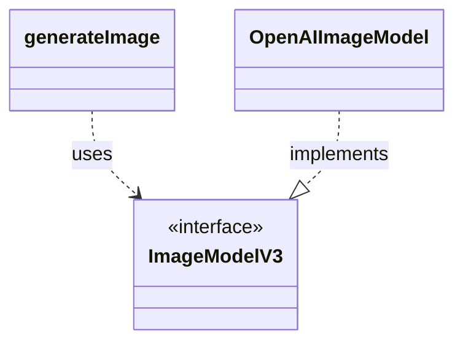
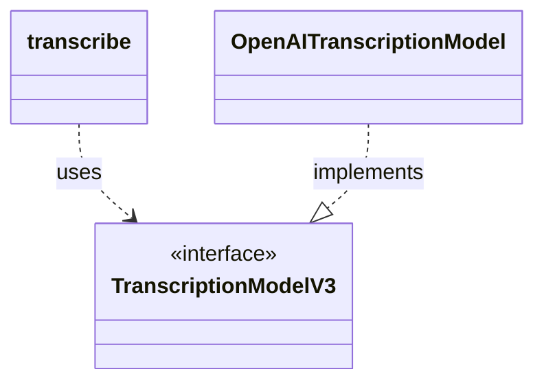
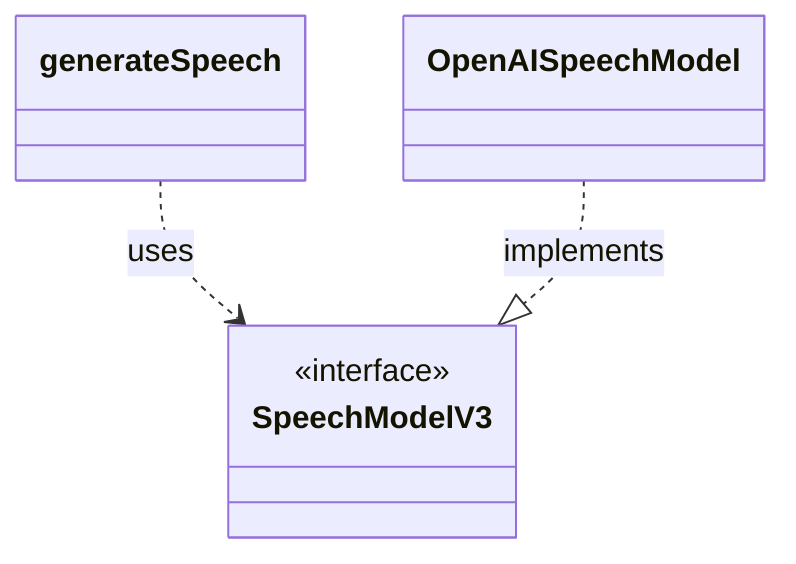
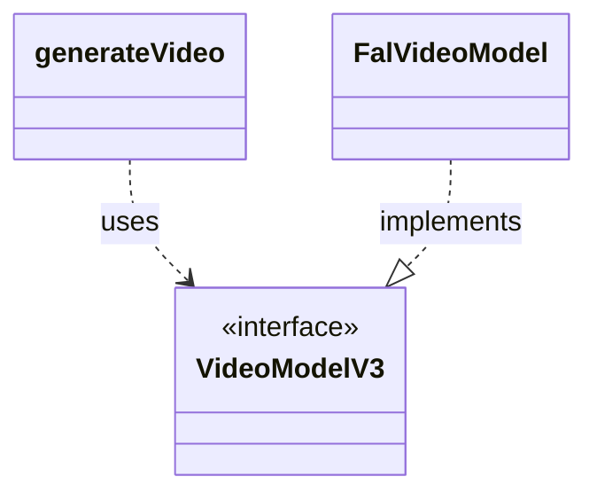

# Provider Abstraction Architecture

This document explains how AI functions, model specifications, and provider implementations connect in the AI SDK.
It starts with an abstract high-level view and then details each V3 model type, including the AI functions that use it and small UML diagrams.

## High-Level Architecture

- **AI functions**: user-facing language functions (for example, `streamText`)
- **Model specification**: `LanguageModelV3`
- **Provider implementations**: provider-specific language model implementations of `LanguageModelV3`

## Model-Type Details

If you're unable to find any of the functions mentioned below in the codebase, they may only exist with an `experimental_` prefix. This means they're experimental, and stable versions will likely be implemented at a later point.

### Language Model (`LanguageModelV3`)

Language models are used for text generation and structured generation workflows from prompt or message input.

- **AI functions**
  - `generateText` - [`packages/ai/src/generate-text/generate-text.ts`](packages/ai/src/generate-text/generate-text.ts) - Generates a complete text result from a language model in a single call.
  - `streamText` - [`packages/ai/src/generate-text/stream-text.ts`](packages/ai/src/generate-text/stream-text.ts) - Streams language model output incrementally as it is produced.
- **Model specification**
  - `LanguageModelV3` - [`packages/provider/src/language-model/v3/language-model-v3.ts`](packages/provider/src/language-model/v3/language-model-v3.ts)
- **Provider implementations (examples)**
  - [`OpenAIChatLanguageModel`](packages/openai/src/chat/openai-chat-language-model.ts), [`AnthropicMessagesLanguageModel`](packages/anthropic/src/anthropic-messages-language-model.ts)

### Embedding Model (`EmbeddingModelV3`)

Embedding models are used to convert text into numeric vectors for similarity and retrieval use cases.

- **AI functions**
  - `embed` - [`packages/ai/src/embed/embed.ts`](packages/ai/src/embed/embed.ts) - Creates a single embedding vector for one text value.
  - `embedMany` - [`packages/ai/src/embed/embed-many.ts`](packages/ai/src/embed/embed-many.ts) - Creates embedding vectors for multiple text values, batching calls when needed.
- **Model specification**
  - `EmbeddingModelV3` - [`packages/provider/src/embedding-model/v3/embedding-model-v3.ts`](packages/provider/src/embedding-model/v3/embedding-model-v3.ts)
- **Provider implementations (examples)**
  - [`OpenAIEmbeddingModel`](packages/openai/src/embedding/openai-embedding-model.ts), [`MistralEmbeddingModel`](packages/mistral/src/mistral-embedding-model.ts)

### Image Model (`ImageModelV3`)

Image models are used to generate image outputs from text prompts.

- **AI functions**
  - `generateImage` - [`packages/ai/src/generate-image/generate-image.ts`](packages/ai/src/generate-image/generate-image.ts) - Generates one or more images from prompt input.
- **Model specification**
  - `ImageModelV3` - [`packages/provider/src/image-model/v3/image-model-v3.ts`](packages/provider/src/image-model/v3/image-model-v3.ts)
- **Provider implementations (examples)**
  - [`OpenAIImageModel`](packages/openai/src/image/openai-image-model.ts), [`GoogleGenerativeAIImageModel`](packages/google/src/google-generative-ai-image-model.ts)

### Reranking Model (`RerankingModelV3`)

Reranking models are used to reorder candidate documents by relevance to a query.

- **AI functions**
  - `rerank` - [`packages/ai/src/rerank/rerank.ts`](packages/ai/src/rerank/rerank.ts) - Reorders documents and returns a relevance-ranked result set for a query.
- **Model specification**
  - `RerankingModelV3` - [`packages/provider/src/reranking-model/v3/reranking-model-v3.ts`](packages/provider/src/reranking-model/v3/reranking-model-v3.ts)
- **Provider implementations (examples)**
  - [`CohereRerankingModel`](packages/cohere/src/reranking/cohere-reranking-model.ts), [`BedrockRerankingModel`](packages/amazon-bedrock/src/reranking/bedrock-reranking-model.ts)

### Transcription Model (`TranscriptionModelV3`)

Transcription models are used to convert audio input into text transcripts.

- **AI functions**
  - `transcribe` - [`packages/ai/src/transcribe/transcribe.ts`](packages/ai/src/transcribe/transcribe.ts) - Transcribes audio into text with segment and metadata support.
- **Model specification**
  - `TranscriptionModelV3` - [`packages/provider/src/transcription-model/v3/transcription-model-v3.ts`](packages/provider/src/transcription-model/v3/transcription-model-v3.ts)
- **Provider implementations (examples)**
  - [`OpenAITranscriptionModel`](packages/openai/src/transcription/openai-transcription-model.ts), [`DeepgramTranscriptionModel`](packages/deepgram/src/deepgram-transcription-model.ts)

### Speech Model (`SpeechModelV3`)

Speech models are used to synthesize audio from text input.

- **AI functions**
  - `generateSpeech` - [`packages/ai/src/generate-speech/generate-speech.ts`](packages/ai/src/generate-speech/generate-speech.ts) - Generates speech audio from text input.
- **Model specification**
  - `SpeechModelV3` - [`packages/provider/src/speech-model/v3/speech-model-v3.ts`](packages/provider/src/speech-model/v3/speech-model-v3.ts)
- **Provider implementations (examples)**
  - [`OpenAISpeechModel`](packages/openai/src/speech/openai-speech-model.ts), [`ElevenLabsSpeechModel`](packages/elevenlabs/src/elevenlabs-speech-model.ts)

### Video Model (`VideoModelV3`)

Video models are used to generate video outputs from prompts.

- **AI functions**
  - `generateVideo` - [`packages/ai/src/generate-video/generate-video.ts`](packages/ai/src/generate-video/generate-video.ts) - Generates one or more videos from prompt input.
- **Model specification**
  - `VideoModelV3` - [`packages/provider/src/video-model/v3/video-model-v3.ts`](packages/provider/src/video-model/v3/video-model-v3.ts)
- **Provider implementations (examples)**
  - [`FalVideoModel`](packages/fal/src/fal-video-model.ts), [`ReplicateVideoModel`](packages/replicate/src/replicate-video-model.ts)

