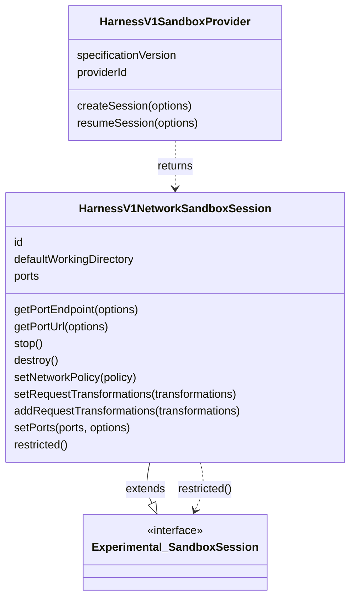

# Sandbox Abstraction Architecture

This document explains the two-tier sandbox abstraction in the AI SDK.
It starts with the basic sandbox session surface and then describes the harness-specific layer.
For how `HarnessAgent` and harness adapters use these contracts, see the [harness abstraction architecture](./harness-abstraction.md).

## High-Level Architecture

- **Basic sandbox session**: `Experimental_SandboxSession`
- **Network sandbox session**: `HarnessV1NetworkSandboxSession`, an extension of `Experimental_SandboxSession`
- **Sandbox provider**: `HarnessV1SandboxProvider`

The basic layer is the file and process API.
The network layer adds resource identity, port resolution, lifecycle, and provider-managed creation/resume.

## Basic Layer: `Experimental_SandboxSession`

Implement this layer when consumers only need filesystem and process APIs.

- `description`
- `readFile()`, `readBinaryFile()`, `readTextFile()`
  - `readBinaryFile()` and `readTextFile()` can be implemented to wrap `readFile()`, unless dedicated methods exist in the underlying sandbox SDK
- `writeFile()`, `writeBinaryFile()`, `writeTextFile()`
  - `writeBinaryFile()` and `writeTextFile()` can be implemented to wrap `writeFile()`, unless dedicated methods exist in the underlying sandbox SDK
- `spawn()`, `run()`
  - `run()` can be implemented to wrap `spawn()`, unless a dedicated method exists in the underlying sandbox SDK

```ts
import type { Experimental_SandboxSession } from 'ai';

async function inspectPackageJson({
  sandbox,
}: {
  sandbox: Experimental_SandboxSession;
}) {
  return sandbox.readTextFile({ path: 'package.json' });
}
```

The basic layer does not describe how the sandbox is created, stopped, destroyed, resumed, or exposed over a network.

## Advanced Layer: Harness Network Sandbox

Implement this layer when consumers need ports, network policy or request transformations, lifecycle methods, or provider-managed creation and resume.

- `HarnessV1NetworkSandboxSession` extends `Experimental_SandboxSession`
- `HarnessV1SandboxProvider` creates and resumes network sandbox sessions
- `restricted()` narrows a network sandbox session back to the basic sandbox surface
  - this is crucial for passing the sandbox to tool execution functions, to prevent the tools from calling advanced network sandbox methods they are not allowed to use



It is recommended that you implement this sandbox layer decoupled from the basic sandbox layer. Ideally the advanced layer extends the basic layer, but allows to use the basic layer on its own. That way the sandbox implementation satisfies both use-cases efficiently.

```ts
import type {
  HarnessV1NetworkSandboxSession,
  HarnessV1SandboxProvider,
} from '@ai-sdk/harness';

type CreateSessionOptions = NonNullable<
  Parameters<HarnessV1SandboxProvider['createSession']>[0]
>;

class DockerSandboxProvider implements HarnessV1SandboxProvider {
  readonly specificationVersion = 'harness-sandbox-v1' as const;
  readonly providerId = 'docker-sandbox';

  async createSession(
    options: CreateSessionOptions = {},
  ): Promise<HarnessV1NetworkSandboxSession> {
    const image = await prepareDockerImage({
      identity: options.identity,
      onFirstCreate: options.onFirstCreate,
      abortSignal: options.abortSignal,
    });

    return createDockerContainer({
      image,
      sessionId: options.sessionId,
      abortSignal: options.abortSignal,
    });
  }
}
```

## Relationship Between the Layers

The advanced layer is additive.
Every `HarnessV1NetworkSandboxSession` is also an `Experimental_SandboxSession`.

`getPortEndpoint()` returns the public URL together with any headers required
to connect to it. `getPortUrl()` remains available for compatibility but is
deprecated because it drops those headers.

`destroy()` stops the sandbox session before performing any additional cleanup,
such as deleting the backing resource or freeing resources. Implementations
with no additional cleanup can implement `destroy()` by calling `stop()`.

`restricted()` is the boundary between infrastructure code and user/tool code for a network sandbox session.

## Harness integration

The harness abstraction document defines how these contracts are used:

- [Sandbox ownership and lifecycle](./harness-abstraction.md#sandbox-ownership-and-lifecycle) covers provisioning, resume, and lifecycle behavior.
- [Adapter runtime placement](./harness-abstraction.md#adapter-runtime-placement) covers host-driven and bridge-backed adapters, including bridge port requirements.
- [Credential handling](./harness-abstraction.md#credential-handling) covers request transformations and credential brokering.

## Choosing a Layer

Use the basic layer when consumers need only filesystem and process APIs.

Use the network layer when consumers need ports, network policy or request transformations, or lifecycle methods. Also implement `HarnessV1SandboxProvider` when creation, resume, or bootstrap caching should be provider-managed.

## Reference Implementations

- Basic session API - [`packages/provider-utils/src/types/sandbox.ts`](../packages/provider-utils/src/types/sandbox.ts)
- Network session API - [`packages/harness/src/v1/harness-v1-network-sandbox-session.ts`](../packages/harness/src/v1/harness-v1-network-sandbox-session.ts)
- Sandbox provider API - [`packages/harness/src/v1/harness-v1-sandbox-provider.ts`](../packages/harness/src/v1/harness-v1-sandbox-provider.ts)
- Vercel sandbox provider - [`packages/sandbox-vercel/src/vercel-sandbox.ts`](../packages/sandbox-vercel/src/vercel-sandbox.ts)
- Just Bash sandbox provider - [`packages/sandbox-just-bash/src/just-bash-sandbox.ts`](../packages/sandbox-just-bash/src/just-bash-sandbox.ts)
