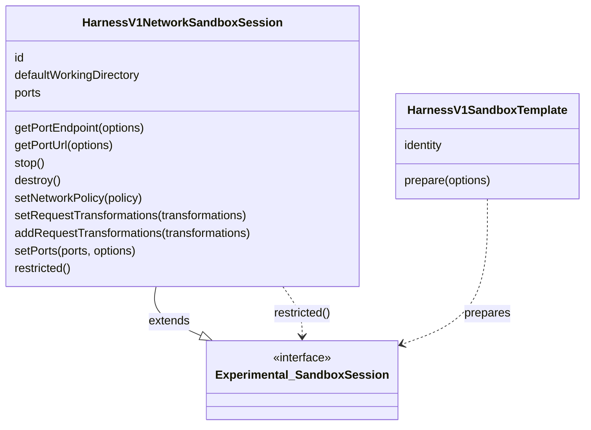

# Sandbox Abstraction Architecture

This document explains the two-tier sandbox abstraction in the AI SDK.
It starts with the basic sandbox session surface and then describes the harness-specific layer.
For how `HarnessAgent` and harness adapters use these contracts, see the [harness abstraction architecture](./harness-abstraction.md).

## High-Level Architecture

- **Basic sandbox session**: `Experimental_SandboxSession`
- **Network sandbox session**: `HarnessV1NetworkSandboxSession`, an extension of `Experimental_SandboxSession`
- **Sandbox template**: `HarnessV1SandboxTemplate` prepares a basic session before reuse

The basic layer is the file and process API.
The network layer adds resource identity, port resolution, and lifecycle. Each sandbox adapter creates or reattaches its own native sandbox and exposes a network session.

## Basic Layer: `Experimental_SandboxSession`

Implement this layer when consumers only need filesystem and process APIs.

- `description`
- `readFile()`, `readBinaryFile()`, `readTextFile()`
  - `readBinaryFile()` and `readTextFile()` can be implemented to wrap `readFile()`, unless dedicated methods exist in the underlying sandbox SDK
- `writeFile()`, `writeBinaryFile()`, `writeTextFile()`
  - `writeBinaryFile()` and `writeTextFile()` can be implemented to wrap `writeFile()`, unless dedicated methods exist in the underlying sandbox SDK
- `spawn()`, `run()`
  - `run()` can be implemented to wrap `spawn()`, unless a dedicated method exists in the underlying sandbox SDK

```ts
import type { Experimental_SandboxSession } from 'ai';

async function inspectPackageJson({
  sandbox,
}: {
  sandbox: Experimental_SandboxSession;
}) {
  return sandbox.readTextFile({ path: 'package.json' });
}
```

The basic layer does not describe how the sandbox is created, stopped, destroyed, resumed, or exposed over a network.

## Extended Layer: Harness Network Sandbox

Implement this layer when consumers need ports, network policy or request transformations, or lifecycle methods.

- `HarnessV1NetworkSandboxSession` extends `Experimental_SandboxSession`
- A provider-specific async creator accepts native creation options plus certain shared properties controlled via [`HarnessV1SandboxSessionCreateOptions<TProviderOptions>`](../packages/harness/src/v1/harness-v1-sandbox-session-create-options.ts)
- A provider-specific async resume function accepts lookup options plus the shared [`HarnessV1SandboxSessionResumeOptions<TProviderOptions>`](../packages/harness/src/v1/harness-v1-sandbox-session-resume-options.ts); synchronous adaptations wrap an already available native instance
- `restricted()` narrows a network sandbox session back to the basic sandbox surface
  - this is crucial for passing the sandbox to tool execution functions, to prevent the tools from calling network sandbox methods they are not allowed to use



The network session extends the basic session interface while allowing sandbox adapters to expose the basic session on its own.

```ts
import type {
  HarnessV1NetworkSandboxSession,
  HarnessV1SandboxSessionCreateOptions,
  HarnessV1SandboxSessionResumeOptions,
} from '@ai-sdk/harness';

type DockerCreateOptions = HarnessV1SandboxSessionCreateOptions<{
  image?: string;
}>;

type DockerResumeOptions = HarnessV1SandboxSessionResumeOptions<{
  endpoint?: string;
}>;

async function createDockerNetworkSandboxSession(
  options: DockerCreateOptions = {},
): Promise<HarnessV1NetworkSandboxSession> {
  const image = await prepareDockerImage({
    baseImage: options.image,
    identity: options.template?.identity,
    prepare: options.template?.prepare,
    abortSignal: options.abortSignal,
  });
  return createDockerContainer({
    image,
    name: options.sandboxId,
    abortSignal: options.abortSignal,
  });
}

async function resumeDockerNetworkSandboxSession(
  options: DockerResumeOptions,
): Promise<HarnessV1NetworkSandboxSession> {
  return reattachDockerContainer({
    name: options.sandboxId,
    endpoint: options.endpoint,
    abortSignal: options.abortSignal,
  });
}
```

The creator starts a new sandbox; `sandboxId` on creation names it and never
looks it up. For named sandboxes, an existing name conflicts with creation.
The resume function uses its required `sandboxId` to find an existing sandbox
and never creates one.

## Relationship Between the Layers

The extended layer is additive.
Every `HarnessV1NetworkSandboxSession` is also an `Experimental_SandboxSession`.

`getPortEndpoint()` returns the public URL together with any headers required
to connect to it. `getPortUrl()` remains available for compatibility but is
deprecated because it drops those headers.

`destroy()` stops the sandbox session before performing any additional cleanup,
such as deleting the backing resource or freeing resources. Implementations
with no additional cleanup can implement `destroy()` by calling `stop()`.

`restricted()` is the boundary between infrastructure code and user/tool code for a network sandbox session.

## Harness integration

The harness abstraction document defines how these contracts are used:

- [Sandbox ownership and lifecycle](./harness-abstraction.md#sandbox-ownership-and-lifecycle) covers provisioning, resume, and lifecycle behavior.
- [Adapter runtime placement](./harness-abstraction.md#adapter-runtime-placement) covers host-driven and bridge-backed adapters, including bridge port requirements.
- [Credential handling](./harness-abstraction.md#credential-handling) covers request transformations and credential brokering.

## Choosing a Layer

Use the basic layer when consumers need only filesystem and process APIs.

Use the network layer when consumers need ports, network policy or request transformations, or lifecycle methods. Implement creation and resume with the native SDK, applying an optional `HarnessV1SandboxTemplate` only on creation. A native adaptation should only wrap the native instance; its explicit lifecycle methods delegate to the native SDK. The caller chooses when to stop or destroy it.

## Reference Implementations

- Basic session API - [`packages/provider-utils/src/types/sandbox.ts`](../packages/provider-utils/src/types/sandbox.ts)
- Network session API - [`packages/harness/src/v1/harness-v1-network-sandbox-session.ts`](../packages/harness/src/v1/harness-v1-network-sandbox-session.ts)
- Shared creator options - [`packages/harness/src/v1/harness-v1-sandbox-session-create-options.ts`](../packages/harness/src/v1/harness-v1-sandbox-session-create-options.ts)
- Shared resume options - [`packages/harness/src/v1/harness-v1-sandbox-session-resume-options.ts`](../packages/harness/src/v1/harness-v1-sandbox-session-resume-options.ts)
- Template contract - [`packages/harness/src/v1/harness-v1-sandbox-template.ts`](../packages/harness/src/v1/harness-v1-sandbox-template.ts)
- Template creation - [`packages/harness/src/agent/create-harness-sandbox-template.ts`](../packages/harness/src/agent/create-harness-sandbox-template.ts)
- Vercel sandbox sessions - [`packages/sandbox-vercel/src/vercel-sandbox.ts`](../packages/sandbox-vercel/src/vercel-sandbox.ts)
- Just Bash sandbox sessions - [`packages/sandbox-just-bash/src/just-bash-sandbox.ts`](../packages/sandbox-just-bash/src/just-bash-sandbox.ts)
