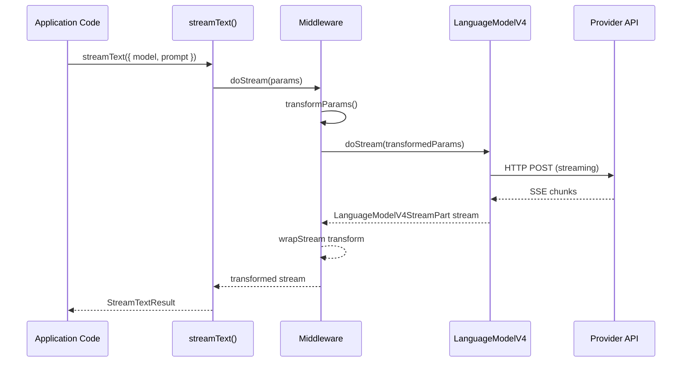
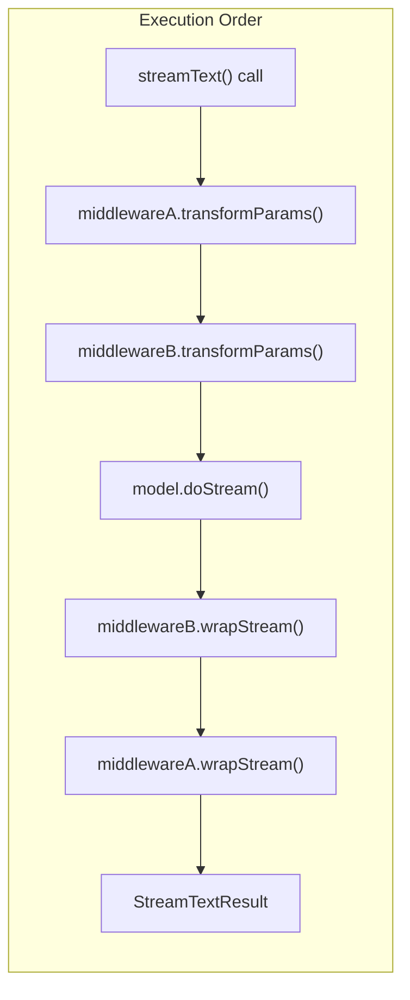
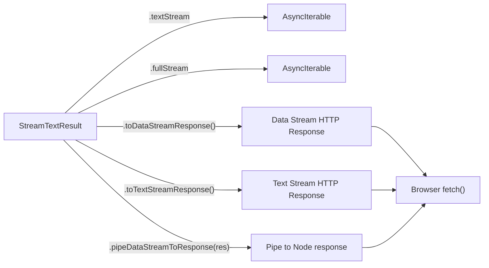
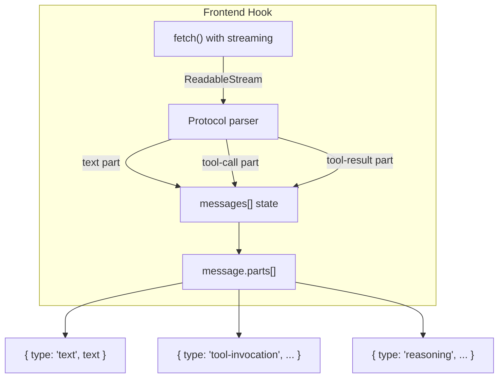
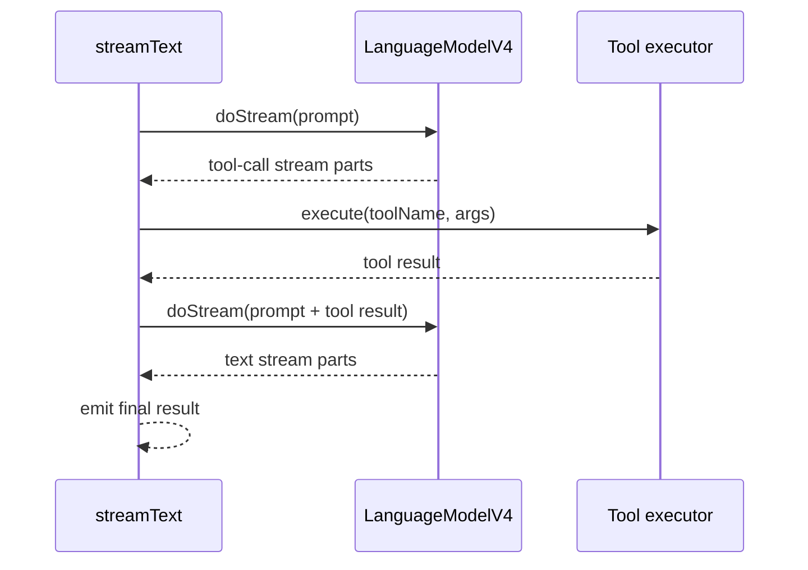

# Streaming Data Flow Architecture

This document describes how streaming data moves through the AI SDK, from the provider's HTTP response to the UI component rendering in the browser. It covers both the backend pipeline (`streamText` and its internal transforms) and the frontend consumption path (`useChat`, `useCompletion`).

## End-to-End Overview

```mermaid
flowchart LR
    subgraph Provider["AI Provider (e.g. OpenAI)"]
        API["HTTP SSE / chunked response"]
    end

    subgraph Core["AI SDK Core (server)"]
        LM["LanguageModelV4.doStream()"]
        MW["Middleware pipeline"]
        ST["streamText()"]
        TP["Part transform stream"]
        DR["DataStreamResponse"]
    end

    subgraph Transport["HTTP Transport"]
        HTTP["Chunked HTTP response"]
    end

    subgraph UI["AI SDK UI (browser)"]
        UC["useChat / useCompletion"]
        PS["Stream parser"]
        State["React / Vue / Svelte state"]
        Render["Rendered UI"]
    end

    API -->|raw chunks| LM
    LM -->|LanguageModelV4StreamPart| MW
    MW -->|transformed parts| ST
    ST -->|internal stream| TP
    TP -->|formatted parts| DR
    DR -->|data stream protocol| HTTP
    HTTP -->|SSE chunks| PS
    PS -->|parsed parts| UC
    UC -->|state updates| State
    State --> Render
```

## Provider to Core

When `streamText()` is called, it resolves the model reference to a `LanguageModelV4` implementation (e.g. `OpenAIChatLanguageModel`). The model's `doStream()` method opens an HTTP connection to the provider API and returns a `ReadableStream<LanguageModelV4StreamPart>`.

Stream part types include:

- `text-start` / `text-delta` / `text-end` — incremental text generation
- `tool-call-start` / `tool-call-delta` / `tool-call-end` — tool invocations
- `reasoning` — model reasoning content
- `source` — source attribution
- `finish` / `error` — terminal events

## Middleware Pipeline

Middleware wraps the model using `wrapLanguageModel()`. When multiple middlewares are provided, they are applied in reverse order so the first middleware in the array is the outermost wrapper.

For a call with `[middlewareA, middlewareB]`:

Each middleware can intercept at three points:

| Hook | Phase | Use Case |
|------|-------|----------|
| `transformParams` | Before model call | RAG injection, prompt rewriting |
| `wrapGenerate` | Around `doGenerate` | Caching, guardrails, logging |
| `wrapStream` | Around `doStream` | Stream transformation, logging |

## Core to UI

The `streamText()` result provides multiple consumption methods:

### Data Stream Protocol

The data stream protocol encodes typed parts as newline-delimited messages. Each line has a type prefix followed by the payload. This allows the frontend to distinguish between text chunks, tool calls, errors, and metadata without ambiguity.

### Frontend Parsing

On the frontend, `useChat` and `useCompletion` open a fetch request and parse the incoming stream using the appropriate protocol parser. Parsed parts update the hook's internal state, which triggers re-renders:

## Tool Call Round-Trip

When the model produces a tool call, the SDK can execute it server-side and feed the result back into the model for another generation round. This loop continues until the model produces a final text response or hits the `maxSteps` limit.

