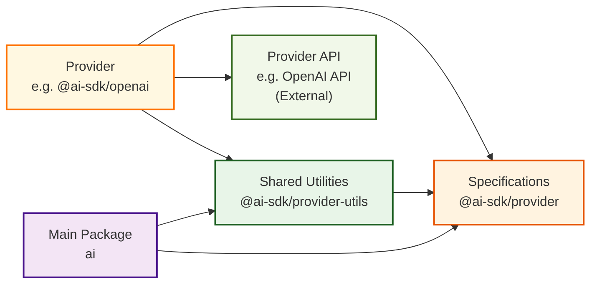

# Provider Architecture

The AI SDK uses a layered provider architecture that follows the adapter pattern, enabling support for multiple AI providers through a unified interface.

## Architecture Overview

