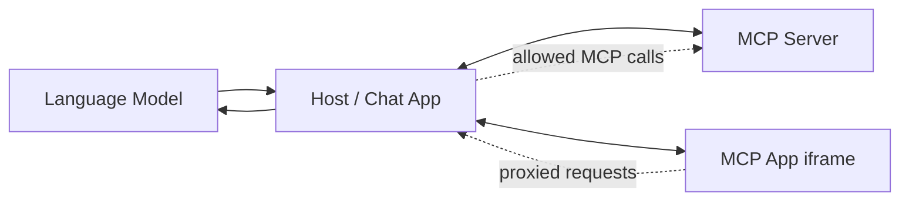
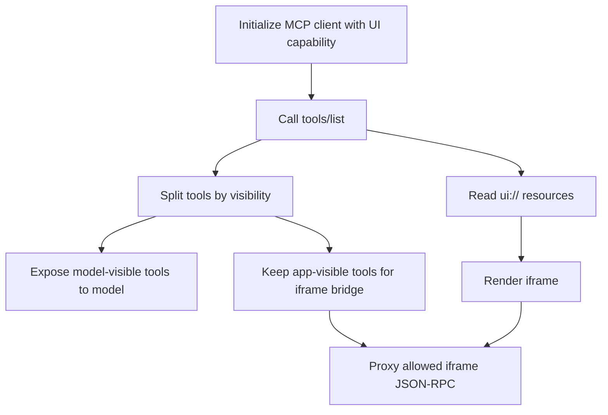
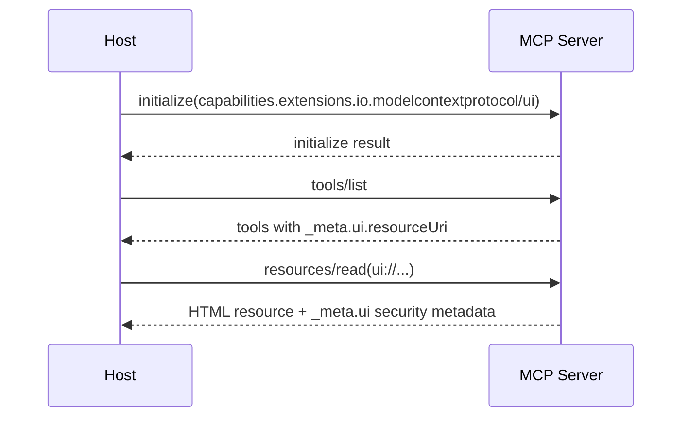
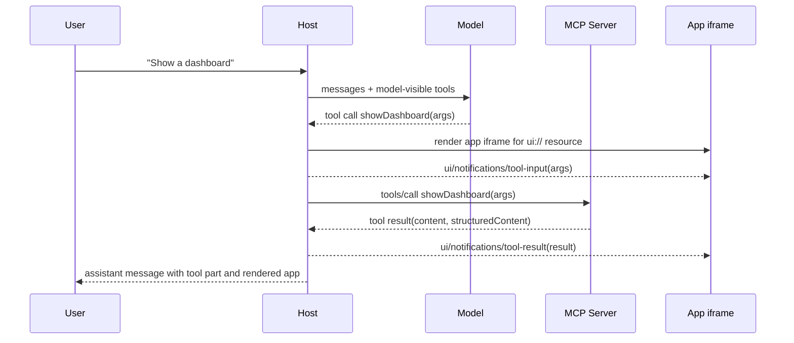
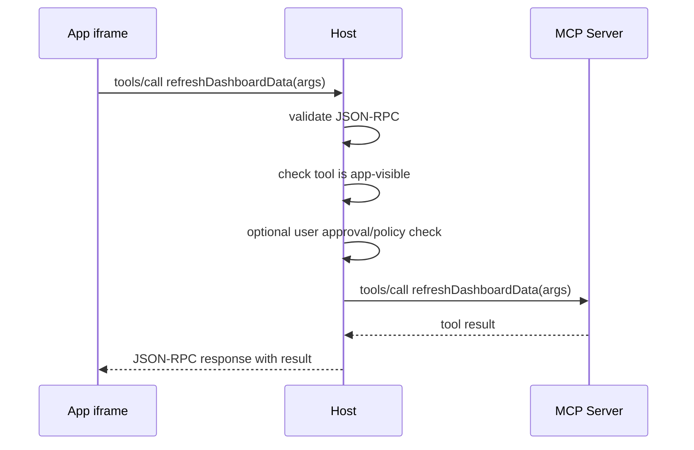
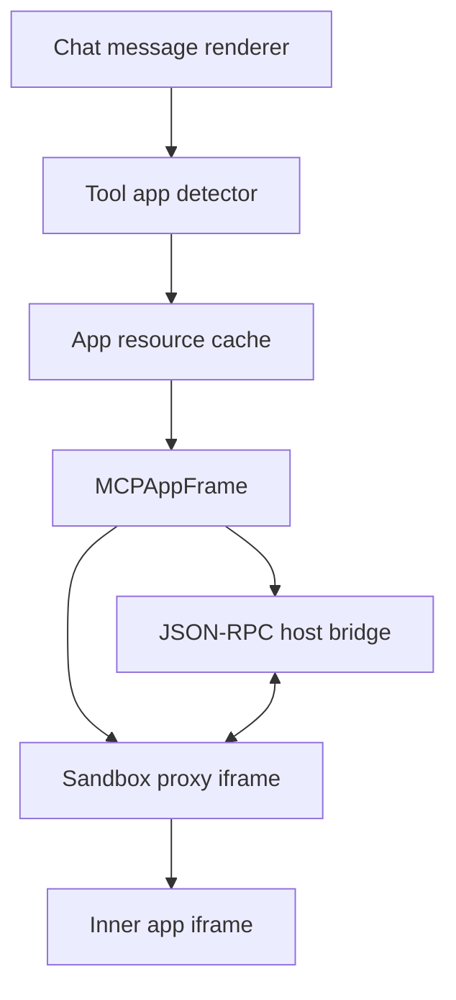
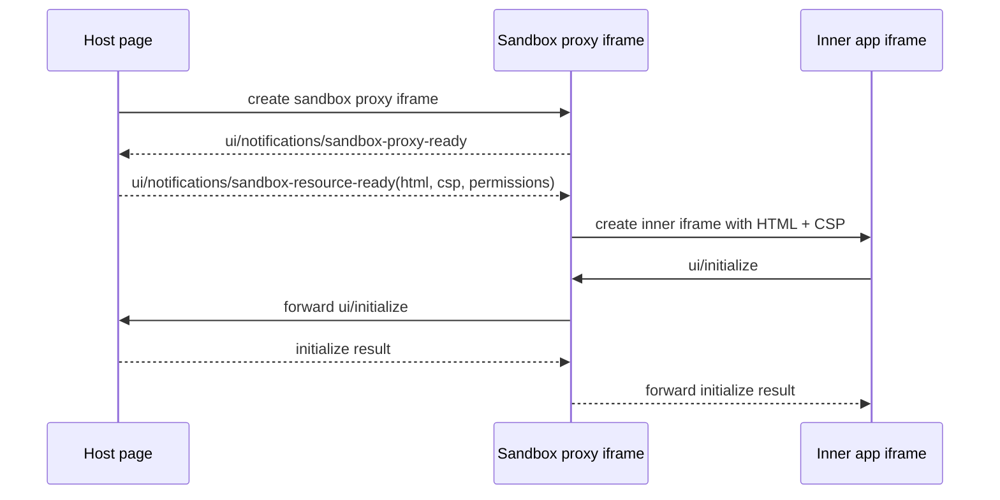

# MCP Apps Protocol Flow

This note explains how MCP Apps work end to end, using the AI SDK e2e example in this folder as the concrete reference.

MCP Apps are an extension to MCP that lets an MCP server provide an interactive UI for a tool. The model still calls ordinary MCP tools. The UI is rendered by the host and communicates with the host through MCP-style JSON-RPC messages over `postMessage`.

References:

- [MCP Apps docs](https://github.com/modelcontextprotocol/ext-apps)
- [MCP Apps announcement](https://blog.modelcontextprotocol.io/posts/2025-11-21-mcp-apps/)

## Actors



AI SDK mapping: the Host is the app using `useChat` with `DefaultChatTransport`, plus route handlers that create MCP clients with `createMCPClient`. The server connection is wrapped here by `createLocalMCPAppsClient`.

There are four important actors:

- **MCP server**: owns tools and `ui://` resources.
- **Host**: the chat client or app runtime. In AI SDK terms, this is the app using `useChat`, route handlers, and MCP clients.
- **Model**: sees only model-visible tools and decides when to call them.
- **MCP App view**: HTML/JS rendered in an iframe. It receives tool input/result data and can request app-visible tool calls.

## Server Responsibilities

The server provides three pieces.

### 1. A UI Resource

The server registers a resource with a `ui://` URI and an MCP Apps MIME type.

```json
{
  "uri": "ui://ai-sdk-e2e/dashboard",
  "name": "dashboard-app",
  "mimeType": "text/html;profile=mcp-app"
}
```

When the host calls `resources/read`, the server returns the app HTML:

```json
{
  "contents": [
    {
      "uri": "ui://ai-sdk-e2e/dashboard",
      "mimeType": "text/html;profile=mcp-app",
      "text": "<!doctype html><html>...</html>",
      "_meta": {
        "ui": {
          "prefersBorder": true,
          "csp": {
            "connectDomains": [],
            "resourceDomains": []
          }
        }
      }
    }
  ]
}
```

### 2. A Model-Visible Tool

The server registers a tool that the model can call. The tool points at the UI resource with `_meta.ui.resourceUri`.

```json
{
  "name": "showDashboard",
  "description": "Show an interactive MCP App dashboard for a topic.",
  "_meta": {
    "ui": {
      "resourceUri": "ui://ai-sdk-e2e/dashboard",
      "visibility": ["model", "app"]
    }
  }
}
```

This tool still returns normal MCP content and structured data. Text-only hosts can ignore the UI and still get useful output.

### 3. Optional App-Only Tools

The server can expose tools only to the iframe app.

```json
{
  "name": "refreshDashboardData",
  "_meta": {
    "ui": {
      "resourceUri": "ui://ai-sdk-e2e/dashboard",
      "visibility": ["app"]
    }
  }
}
```

The host must not expose app-only tools to the model. The iframe can request them through the host bridge.

## Host Responsibilities

The host does most of the work.



AI SDK mapping: `createMCPClient` with `mcpAppClientCapabilities` initializes MCP Apps support, then `client.listTools()`, `splitMCPAppTools()`, `client.toolsFromDefinitions()`, and `readMCPAppResource()` cover tool discovery, filtering, and resource loading. `MCPAppRenderer` owns the iframe render and bridge.

The host:

1. Connects to the MCP server.
2. Advertises the MCP Apps extension capability.
3. Calls `tools/list`.
4. Exposes only model-visible tools to the model.
5. Keeps app-visible tools available for iframe calls.
6. Detects `_meta.ui.resourceUri` on tool definitions.
7. Calls `resources/read` for those `ui://` resources.
8. Renders the HTML in a sandboxed iframe.
9. Sends tool input/result notifications to the iframe.
10. Proxies allowed iframe requests back to the MCP server.

Capability negotiation looks like this:

```json
{
  "capabilities": {
    "extensions": {
      "io.modelcontextprotocol/ui": {
        "mimeTypes": ["text/html;profile=mcp-app"]
      }
    }
  }
}
```

## Discovery Flow



AI SDK mapping: `createLocalMCPAppsClient()` wraps `createMCPClient({ capabilities: mcpAppClientCapabilities })`; discovery then uses `client.listTools()` for raw MCP definitions and `readMCPAppResource()` to validate and normalize the `ui://` HTML resource.

At the end of discovery, the host knows:

- which tools the model can call
- which tools the iframe can call
- which `ui://` resource belongs to each app-backed tool
- what HTML should be rendered
- what CSP and permission metadata the resource requests

## Model Tool Call Flow



AI SDK mapping: the chat route uses `convertToModelMessages()`, `streamText({ tools })`, and `result.toUIMessageStreamResponse()` to produce streamed tool UI parts. The page uses `isToolUIPart()` and `MCPAppRenderer` to recognize app-backed tool parts, load their resource, and render the iframe.

The model does not render the app. It only calls a normal tool. The host sees the tool's MCP Apps metadata and renders the app.

## Iframe Initialization

The app iframe talks to the host using JSON-RPC 2.0 over `postMessage`.

The iframe starts by sending:

```json
{
  "jsonrpc": "2.0",
  "id": 1,
  "method": "ui/initialize",
  "params": {
    "appCapabilities": {
      "availableDisplayModes": ["inline", "fullscreen"]
    },
    "clientInfo": {
      "name": "dashboard-app",
      "version": "1.0.0"
    }
  }
}
```

The host responds:

```json
{
  "jsonrpc": "2.0",
  "id": 1,
  "result": {
    "protocolVersion": "2026-01-26",
    "hostCapabilities": {
      "serverTools": {},
      "serverResources": {},
      "logging": {}
    },
    "hostInfo": {
      "name": "ai-sdk-host",
      "version": "1.0.0"
    },
    "hostContext": {
      "theme": "light",
      "displayMode": "inline"
    }
  }
}
```

After initialization, the host can send app lifecycle and data notifications.

AI SDK mapping: `MCPAppRenderer` creates the underlying `MCPAppBridge`, which answers `ui/initialize` using the component's `hostInfo`, `hostContext`, and configured `handlers`.

## Tool Data Notifications

The host sends the original tool input to the iframe:

```json
{
  "jsonrpc": "2.0",
  "method": "ui/notifications/tool-input",
  "params": {
    "arguments": {
      "topic": "usage"
    }
  }
}
```

When the MCP tool result is available, the host sends:

```json
{
  "jsonrpc": "2.0",
  "method": "ui/notifications/tool-result",
  "params": {
    "content": [
      {
        "type": "text",
        "text": "Rendered an MCP App dashboard for usage."
      }
    ],
    "structuredContent": {
      "topic": "usage",
      "cards": []
    }
  }
}
```

The app can use `structuredContent` for rendering. The `content` array remains the text fallback for the model/user.

AI SDK mapping: `MCPAppRenderer` reads the tool part's `input` and `output`, then the bridge sends `ui/notifications/tool-input` and `ui/notifications/tool-result` after the app initializes.

## App-Initiated Tool Call Flow

This is the "bidirectional" part.



AI SDK mapping: `MCPAppRenderer` forwards iframe `tools/call` requests to `handlers.callTool`. The host route checks app visibility with `splitMCPAppTools(await client.listTools())` and proxies allowed calls with `client.callTool()`.

The iframe does not connect directly to the MCP server. It asks the host. The host decides whether the call is allowed.

Example iframe request:

```json
{
  "jsonrpc": "2.0",
  "id": 2,
  "method": "tools/call",
  "params": {
    "name": "refreshDashboardData",
    "arguments": {
      "reason": "User clicked refresh"
    }
  }
}
```

The host checks:

- Is the message valid JSON-RPC?
- Is the requested tool from the same MCP server?
- Does the tool visibility include `"app"`?
- Does the host policy allow this call?
- Does the user need to approve it?

If allowed, the host proxies the call to the MCP server and returns the result to the iframe.

## Other App Messages

MCP Apps also defines UI-specific methods.

Common iframe-to-host requests:

- `tools/call`: call app-visible tools
- `resources/read`: read resources through the host
- `ui/open-link`: ask host to open a link
- `ui/message`: add a message to the chat
- `ui/update-model-context`: update context for future model turns
- `ui/request-display-mode`: ask for inline/fullscreen/picture-in-picture

Common host-to-iframe notifications:

- `ui/notifications/tool-input`
- `ui/notifications/tool-input-partial`
- `ui/notifications/tool-result`
- `ui/notifications/tool-cancelled`
- `ui/notifications/host-context-changed`
- `ui/resource-teardown`

## UI Components In A Host

A complete host has several UI/runtime components.



AI SDK mapping: `useChat` provides streamed message parts, `isToolUIPart()` identifies tool parts, and `MCPAppRenderer` combines app detection, resource loading, sandbox iframe creation, and JSON-RPC bridge wiring.

### Chat Message Renderer

Renders normal text, reasoning, files, and tool parts.

### Tool App Detector

Looks at each tool part and decides whether it has an MCP App attached.

Long term, this should be a first-class field:

```ts
part.experimental_mcpApp = {
  resourceUri: 'ui://ai-sdk-e2e/dashboard',
  mimeType: 'text/html;profile=mcp-app',
};
```

The page should not dig through raw provider metadata.

### App Resource Cache

Stores fetched `ui://` resources. This avoids fetching the same app HTML for every tool call.

### MCP App Frame

The UI component that renders the app. Its ideal API is small:

```tsx
<MCPAppFrame
  app={part.experimental_mcpApp}
  input={part.input}
  output={part.output}
/>
```

### Host Bridge

Owns the JSON-RPC message handling between the iframe and the host.

It receives iframe messages, validates them, applies policy, and proxies allowed calls to the MCP server.

### Sandbox Proxy

For production web hosts, the host should not directly use `srcDoc` with untrusted server HTML.

Instead:

1. Host renders an outer sandbox proxy iframe on a separate origin.
2. The proxy tells the host it is ready.
3. The host sends the raw app HTML to the proxy.
4. The proxy creates the inner app iframe.
5. The proxy applies CSP and permissions.
6. The proxy forwards JSON-RPC messages between host and app.

## Production Sandbox Flow



AI SDK mapping: `MCPAppRenderer` renders the outer iframe from its `sandbox` prop, waits for `ui/notifications/sandbox-proxy-ready`, then posts the `MCPAppResource` HTML, CSP, permissions, and inner sandbox settings through the bridge.

The sandbox proxy exists because app HTML is untrusted. It helps enforce:

- sandboxed execution
- separate origin isolation
- CSP from resource `_meta.ui.csp`
- permission policy from `_meta.ui.permissions`
- auditable host-controlled communication
- blocking of undeclared network/resource domains

## How This Maps To AI SDK

The intended AI SDK split is:

### `@ai-sdk/mcp`

Responsible for MCP protocol concepts:

- advertise MCP Apps capability
- parse `_meta.ui`
- filter tools by visibility
- preserve normalized app metadata
- read `ui://` resources

### `ai`

Responsible for core message/tool surfaces:

- carry app metadata onto tool UI parts
- keep model context separate from app HTML
- continue sending normal tool `content` and `structuredContent`

### `@ai-sdk/react`

Responsible for browser host behavior:

- render `<MCPAppFrame />`
- implement sandbox proxy
- implement iframe JSON-RPC bridge
- forward tool input/result notifications
- proxy app-visible `tools/call`
- handle sizing, theme, display modes, link opening, teardown

## Current E2E Example

The e2e in this folder is a prototype:

- `server/route.ts` creates an MCP server with a UI resource and app-backed tools.
- `chat/route.ts` connects to that server, exposes model-visible tools, reads app resources, and proxies app-visible tool calls from the iframe.
- `page.tsx` renders messages and delegates app-backed tool parts to the reusable MCP Apps frame.

The final SDK shape should move most of the logic currently in `page.tsx` into reusable host components. The page should mostly render messages and delegate app parts to an MCP Apps renderer.

