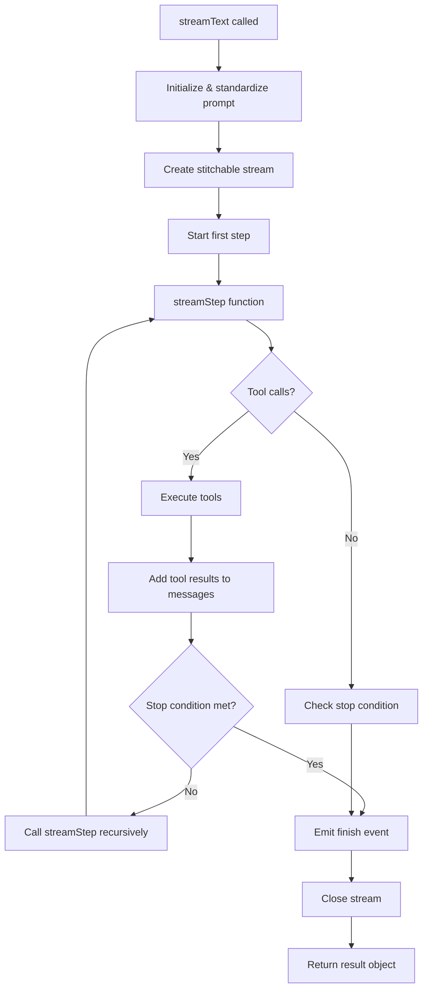
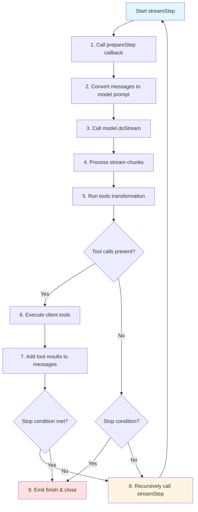
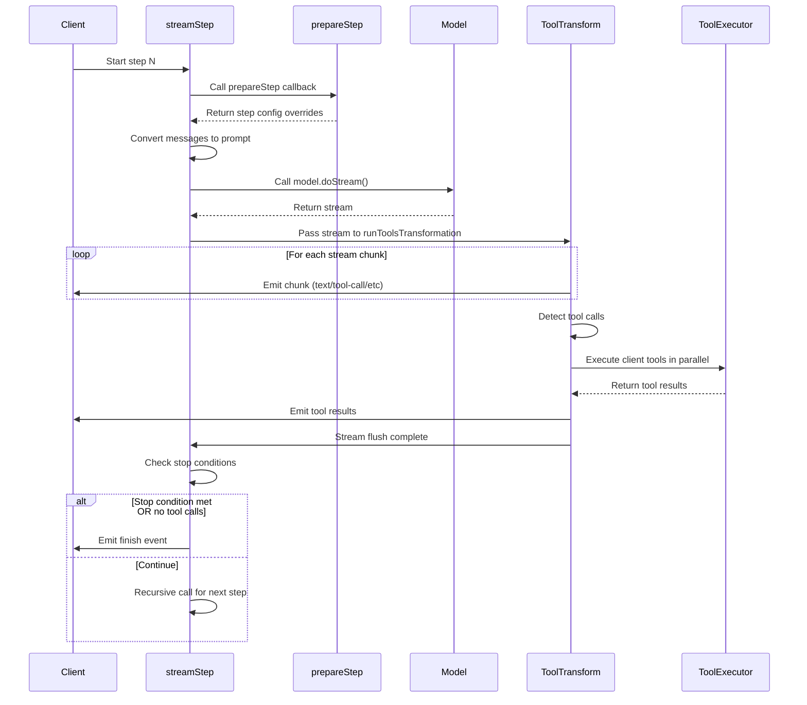
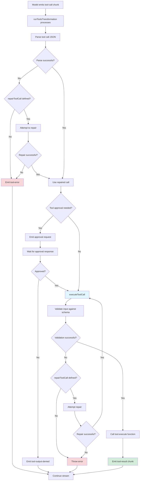
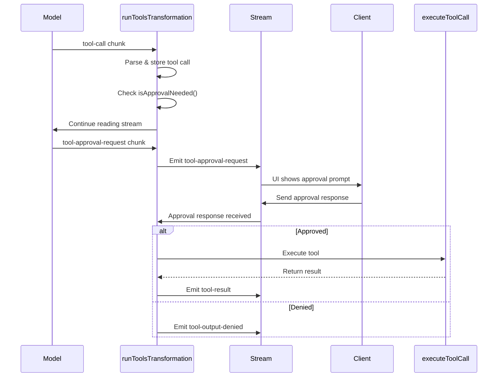
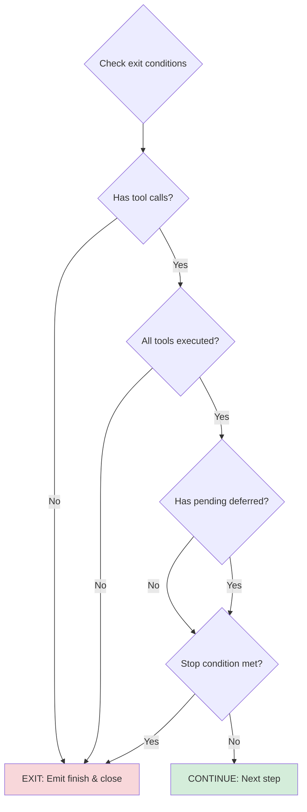
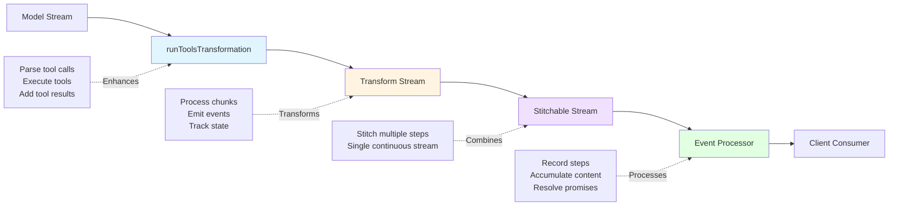

# How streamText Works

This document explains the internal workings of the `streamText` function in the AI SDK, including the step loop, tool execution, and exit conditions.

## Table of Contents

- [Overview](#overview)
- [High-Level Architecture](#high-level-architecture)
- [The Step Loop](#the-step-loop)
- [What Happens in a Single Step](#what-happens-in-a-single-step)
- [Tool Execution Flow](#tool-execution-flow)
- [Loop Exit Conditions](#loop-exit-conditions)
- [Stream Processing Pipeline](#stream-processing-pipeline)

## Overview

`streamText` is a function that orchestrates streaming text generation from language models with support for:

- **Multi-step agent loops**: Enables tool calling and iterative reasoning
- **Tool execution**: Automatic execution of tools requested by the model
- **Stream processing**: Real-time streaming of text, tool calls, and results
- **Error handling**: Retries, timeouts, and error recovery
- **Telemetry**: OpenTelemetry tracing for observability

## High-Level Architecture



## The Step Loop

The step loop is implemented using **recursive function calls** rather than a traditional while/for loop. This design allows each step to be processed as a separate stream that gets stitched together.

### Loop Structure



### Key Points

1. **No explicit loop**: The loop is achieved through recursive calls to `streamStep`
2. **Step initialization**: Each step starts at line 1305 with `async function streamStep({...})`
3. **Recursion point**: Line 1849 - `await streamStep({ currentStep: currentStep + 1, ... })`
4. **Base case**: Loop exits when stop conditions are met or no tool calls remain

### Code Location

- **Function definition**: `/packages/ai/src/generate-text/stream-text.ts:1305`
- **Initial call**: Line 1883 - `await streamStep({ currentStep: 0, ... })`
- **Recursive call**: Line 1849 - called from flush handler after step completes

## What Happens in a Single Step

Each step processes a single request-response cycle with the language model.

### Step Execution Sequence



### Detailed Step Breakdown

#### 1. Step Initialization (lines 1305-1363)

```typescript
async function streamStep({
  currentStep,
  responseMessages,
  usage,
}: {
  currentStep: number;
  responseMessages: Array<ResponseMessage>;
  usage: LanguageModelUsage;
});
```

- Sets up step and chunk timeouts
- Creates a `DelayedPromise` for step completion tracking
- Calls `prepareStep` callback if provided

#### 2. Prompt Preparation (lines 1354-1385)

```typescript
const stepInputMessages = [...initialMessages, ...responseMessages];

const prepareStepResult = await prepareStep?.({
  model,
  steps: recordedSteps,
  stepNumber: recordedSteps.length,
  messages: stepInputMessages,
  experimental_context,
});
```

- Combines initial messages with accumulated response messages
- Allows dynamic modification via `prepareStep` callback
- Can override: model, system prompt, messages, tool choice, active tools

#### 3. Model Streaming (lines 1391-1456)

```typescript
const {
  result: { stream, response, request },
  doStreamSpan,
} = await retry(() =>
  recordSpan({
    fn: async doStreamSpan => ({
      result: await stepModel.doStream({
        ...callSettings,
        tools: stepTools,
        toolChoice: stepToolChoice,
        prompt: promptMessages,
      }),
    }),
  }),
);
```

- Wraps call in retry logic and telemetry span
- Uses `model.doStream()` to get a streaming response
- Captures timing metrics (time to first chunk, etc.)

#### 4. Tools Transformation (lines 1458-1469)

```typescript
const streamWithToolResults = runToolsTransformation({
  tools,
  generatorStream: stream,
  tracer,
  telemetry,
  system,
  messages: stepInputMessages,
  repairToolCall,
  abortSignal,
  experimental_context,
  generateId,
});
```

- Transforms the raw model stream
- Parses tool calls from the stream
- Executes provider-executed tools
- Returns enhanced stream with tool results

#### 5. Stream Processing (lines 1499-1701)

The stream is piped through a `TransformStream` that:

- **Resets chunk timeout** on each chunk
- **Emits 'start-step' event** on first chunk
- **Processes different chunk types**:
  - `text-delta`: Text content from model
  - `tool-call`: Tool invocation request
  - `tool-result`: Tool execution result
  - `finish`: Step completion
  - And many others (reasoning, files, sources, etc.)

#### 6. Step Completion (lines 1704-1880)

In the `flush()` handler:

1. **Record telemetry** (lines 1710-1755)
2. **Emit 'finish-step' event** (lines 1757-1767)
3. **Wait for step processing** via `stepFinish.promise` (line 1776)
4. **Separate tool calls** into client vs provider-executed (lines 1778-1783)
5. **Track deferred results** from provider tools (lines 1789-1819)
6. **Decision point** (lines 1825-1871):

```typescript
if (
  // Continue if there are tool calls or pending deferred results
  ((clientToolCalls.length > 0 &&
    clientToolOutputs.length === clientToolCalls.length) ||
   pendingDeferredToolCalls.size > 0) &&
  // AND stop condition is not met
  !(await isStopConditionMet({ stopConditions, steps: recordedSteps }))
) {
  // Add tool results to messages
  responseMessages.push(...);

  // RECURSIVE CALL - Start next step
  await streamStep({
    currentStep: currentStep + 1,
    responseMessages,
    usage: combinedUsage,
  });
} else {
  // LOOP EXIT - Emit final finish event and close
  controller.enqueue({ type: 'finish', ... });
  self.closeStream();
}
```

## Tool Execution Flow

Tools can be executed in two ways:

1. **Client-side execution**: Tools executed in the SDK (most common)
2. **Provider-side execution**: Tools executed by the model provider (e.g., computer use, code execution)

### Client-Side Tool Execution Flow



### Tool Execution Code Path

Tool execution happens in multiple phases:

#### Phase 1: Tool Call Parsing (in `runToolsTransformation`)

Location: `/packages/ai/src/generate-text/run-tools-transformation.ts:248-400`

```typescript
case 'tool-call': {
  try {
    const toolCall = await parseToolCall({
      toolCall: chunk,
      tools,
      system,
      messages,
      repairToolCall,
      tracer,
      telemetry,
    });

    // Store for later reference
    toolCallsByToolCallId.set(toolCall.toolCallId, toolCall);

    // Check if approval is needed
    if (isApprovalNeeded({ toolCall, tools })) {
      // Provider will emit approval request
    } else {
      // Mark for execution
      outstandingToolResults.add(toolCall.toolCallId);

      // Execute tool
      executeToolCall({
        toolCall,
        tools,
        // ...
      }).then(result => {
        outstandingToolResults.delete(toolCall.toolCallId);
        toolResultsStreamController!.enqueue(result);
        attemptClose();
      });
    }
  } catch (error) {
    // Emit tool-error
  }
}
```

#### Phase 2: Tool Execution (in `executeToolCall`)

Location: `/packages/ai/src/generate-text/execute-tool-call.ts`

```typescript
export async function executeToolCall({
  toolCall,
  tools,
  messages,
  experimental_context,
  // ...
}): Promise<ToolResult | ToolError> {
  const tool = tools[toolCall.toolName];

  // Validate input against schema
  const validated = await schema.validate(toolCall.input);

  if (!validated.success) {
    throw new ValidationError(...);
  }

  try {
    // Call the tool's execute function
    const result = await tool.execute(validated.value, {
      toolCallId: toolCall.toolCallId,
      messages,
      experimental_context,
    });

    return {
      type: 'tool-result',
      toolCallId: toolCall.toolCallId,
      toolName: toolCall.toolName,
      input: validated.value,
      output: result,
    };
  } catch (error) {
    return {
      type: 'tool-error',
      toolCallId: toolCall.toolCallId,
      toolName: toolCall.toolName,
      error,
    };
  }
}
```

### Tool Approval Flow

For tools that require approval (configured via `tool.approvalRequired`):



### Tool Results Integration

After tool execution completes:

1. **Tool results are collected** (lines 1778-1783 in stream-text.ts)
2. **Results are converted** to response messages (lines 1839-1846)
3. **Messages are appended** to the conversation history
4. **Next step is triggered** with updated messages

```typescript
// Append tool results to messages for the next step
responseMessages.push(
  ...(await toResponseMessages({
    content: recordedSteps[recordedSteps.length - 1].content,
    tools,
  })),
);

// Start next step with tool results included
await streamStep({
  currentStep: currentStep + 1,
  responseMessages,
  usage: combinedUsage,
});
```

## Loop Exit Conditions

The step loop exits when **any** of the following conditions are met:

### 1. Stop Condition Met

Stop conditions are evaluated in the flush handler (line 1833):

```typescript
!(await isStopConditionMet({
  stopConditions,
  steps: recordedSteps,
}));
```

**Default stop condition**: `stepCountIs(1)` - stops after the first step

**Common stop conditions**:

- `stepCountIs(n)`: Stop after exactly n steps
- `stepResultIs((result) => result.toolCalls.length === 0)`: Stop when no tool calls
- Custom functions: `(context) => boolean`

Multiple conditions can be provided as an array - **any** condition being met will stop the loop.

### 2. No Tool Calls to Execute

The loop continues only if there are tool calls to execute:

```typescript
if (
  ((clientToolCalls.length > 0 &&
    clientToolOutputs.length === clientToolCalls.length) ||
    pendingDeferredToolCalls.size > 0) &&
  !(await isStopConditionMet({ stopConditions, steps: recordedSteps }))
) {
  // Continue to next step
} else {
  // Exit loop
}
```

**Exits when**:

- No client tool calls in the step
- Client tools executed but pending outputs don't match
- No pending deferred tool calls from provider

### 3. Error Occurs

Errors immediately exit the loop (line 1854):

```typescript
try {
  await streamStep({
    currentStep: currentStep + 1,
    responseMessages,
    usage: combinedUsage,
  });
} catch (error) {
  controller.enqueue({ type: 'error', error });
  self.closeStream();
}
```

### 4. Abort Signal Triggered

If the `abortSignal` is triggered at any point, the stream stops:

```typescript
if (abortSignal?.aborted) {
  throw new Error('Aborted');
}
```

### Exit Condition Decision Tree



## Stream Processing Pipeline

The stream goes through multiple transformation layers:



### Pipeline Stages

1. **Model Stream** (`LanguageModelV3StreamPart[]`)

   - Raw stream from language model provider
   - Contains: text-delta, tool-call, tool-result, finish, etc.

2. **runToolsTransformation** (`SingleRequestTextStreamPart[]`)

   - Parses tool calls from stream
   - Executes client-side tools
   - Injects tool results back into stream
   - Handles approval requests

3. **Transform Stream** (`TextStreamPart[]`)

   - Adds step-level events (start-step, finish-step)
   - Tracks step metadata (usage, response info)
   - Handles chunk and step timeouts
   - Invokes callbacks (onChunk, onStepFinish)

4. **Stitchable Stream**

   - Combines multiple step streams into one continuous stream
   - Manages stream closing across steps
   - Enables recursive step processing

5. **Event Processor**
   - Records steps for promise resolution
   - Accumulates content parts
   - Builds final result object
   - Resolves promises (text, toolCalls, steps, etc.)

### Stream Part Types

The stream emits various chunk types as it processes:

**Step lifecycle**:

- `start-step`: Step begins
- `finish-step`: Step completes
- `finish`: All steps complete

**Text generation**:

- `text-start`: Text generation begins
- `text-delta`: Incremental text chunk
- `text-end`: Text generation complete

**Tool execution**:

- `tool-input-start`: Tool call begins
- `tool-input-delta`: Incremental tool input
- `tool-input-end`: Tool call complete
- `tool-call`: Parsed tool call
- `tool-result`: Tool execution result
- `tool-error`: Tool execution failed
- `tool-approval-request`: Requesting approval
- `tool-output-denied`: Tool execution denied

**Other**:

- `reasoning-start/delta/end`: Model reasoning traces
- `file`: Generated file
- `source`: Retrieved source/citation
- `error`: Error occurred
- `raw`: Raw provider chunks (if enabled)

## Key Design Decisions

### Why Recursive Instead of Iterative Loop?

1. **Stream composition**: Each step produces its own stream that needs to be added to the stitchable stream
2. **Async boundaries**: Natural async/await flow without complex state management
3. **Error handling**: Each step's errors are isolated and can be handled independently
4. **Telemetry**: Each step gets its own telemetry span

### Why Separate Tool Execution Phase?

1. **Parallel execution**: All tools in a step execute concurrently (`Promise.all`)
2. **Stream integrity**: Tool results are added to stream after all are complete
3. **Provider flexibility**: Supports both client and provider-executed tools
4. **Approval workflow**: Natural point to request and wait for approvals

### Why Use Stitchable Stream?

1. **Multi-step output**: Combines multiple model calls into one stream
2. **Consumer simplicity**: Client sees one continuous stream, not separate steps
3. **Backpressure handling**: Proper stream backpressure across steps
4. **Clean separation**: Each step is independent but connected

## Code References

Key files and line numbers:

- **Main streamText function**: `stream-text.ts:255`
- **streamStep function**: `stream-text.ts:1305`
- **Recursive call**: `stream-text.ts:1849`
- **Stop condition check**: `stream-text.ts:1833`
- **Tool transformation**: `run-tools-transformation.ts:108`
- **Tool execution**: `execute-tool-call.ts`
- **Stop condition logic**: `stop-condition.ts`

## Summary

The `streamText` function implements a sophisticated multi-step agent loop using:

1. **Recursive step execution** for clean async composition
2. **Stream transformation pipeline** for processing model outputs
3. **Parallel tool execution** with approval workflows
4. **Flexible stop conditions** for controlling loop behavior
5. **Comprehensive telemetry** for observability
6. **Error handling and retries** for reliability

The recursive design allows each step to be processed independently while maintaining a continuous stream to the consumer, enabling complex agentic behaviors while keeping the API simple.
