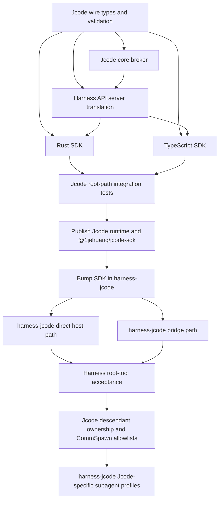

# Host-Defined Tools and Subagents Implementation Playbook

## 0. Purpose and status

This is the execution playbook for implementing host-defined tools and restricted Jcode subagents across two repositories:

- Jcode: `/Users/joan/wrk/jcode`
- AI SDK: `/Users/joan/wrk/ai`

It refines `packages/harness-jcode/docs/TOOLS_AND_SUBAGENTS_PLAN.md` into ordered, agent-executable work. It is not an implementation and does not authorize API invention beyond the decisions below.

**Release gate:** Jcode runtime and `@1jehuang/jcode-sdk` support must be released before `@ai-sdk/harness-jcode` enables host tools. Do not merge or publish the AI SDK production change against an unreleased SDK API.

## 1. Outcome

A HarnessV1 host supplies tool metadata to a Jcode session, receives correlated calls from the root agent or an authorized descendant, executes each tool in the host process, and submits the result. Jcode waits for the result and resumes the model turn. Native Jcode tools remain Jcode-executed.

The first shippable outcome is root-session host tools. Descendant policies and Jcode-specific subagent profiles follow only after the root path is secure and released.

## 2. Principles

1. **Authority stays with the host.** Send names, descriptions, schemas, calls, and results. Never send executable closures, credentials, bearer material, or host application state to Jcode.
2. **Session-scoped, connection-owned capabilities.** An external-tool catalog belongs to one attached root session and one live SDK connection. It is neither process-global nor a persisted executable capability.
3. **Fail closed.** Unknown sessions, unobserved descendants, stale revisions, wrong owners, duplicate results, name collisions, and oversized payloads are errors.
4. **Separate namespaces and lifecycles.** Native/MCP tools and external host tools use separate policy, pending-call storage, events, and Harness translation flags.
5. **Revalidate at execution.** Definition filtering alone is insufficient because Jcode locks tool snapshots. Recheck ownership, revision, membership, and descendant policy immediately before creating a call.
6. **Capabilities only decrease down the tree.** A child gets at most the intersection of its parent's effective external tools and the requested child allowlist.
7. **Ephemeral on resume.** Restoring or attaching a session never revives an old executor. The current connection must register the catalog again.
8. **Smallest useful API.** Implement register/replace/clear, call event, result submission, revocation, and child allowlists. Defer active-turn replacement, binary results, aliases, universal subagent APIs, and policy DSLs.
9. **One broker, one transport.** Use Jcode core plus the existing Harness API/SDK connection. Do not add MCP, HTTP, WebSocket, shell, or prompt-based relays.
10. **Compatibility is additive.** Clients that do not use external tools must behave exactly as before.

## 3. Non-goals

- A universal HarnessV1 subagent/profile API.
- Built-in Jcode tool filtering or approval changes.
- Executing host tools inside Jcode.
- Persisting host-tool authority in transcripts or session state.
- Catalog changes during an active turn in v1.
- Binary, image, file, or streaming tool results in v1. Accept bounded JSON values only.
- Tool aliases or collision-resolution namespaces.
- Per-call host-configurable deadlines in v1.
- Host-tool calls from detached, ambient, or background subagents after the owning Harness prompt turn has settled. HarnessV1 `submitToolResult` is turn-scoped, so v1 descendant calls are permitted only while the root Harness turn that registered the catalog is active.
- General remote multi-tenant authorization. Preserve the current authenticated/local connection boundary and bind ownership to it.
- Stopping or restructuring existing swarm behavior beyond adding a reducing external-tool allowlist.

## 4. Locked decisions

Do not reopen these during implementation unless a stop condition in section 18 is met.

| Topic                   | Decision                                                                                                                                                                       |
| ----------------------- | ------------------------------------------------------------------------------------------------------------------------------------------------------------------------------ |
| Architecture            | First-class external-tool broker in `jcode-app-core`                                                                                                                           |
| Catalog scope           | One live connection + one attached root session                                                                                                                                |
| Catalog update          | Atomic replace. Empty list clears. Idle session and zero pending calls only                                                                                                    |
| Revision                | Monotonic `u64` per root broker catalog                                                                                                                                        |
| Tool names              | Reject invalid, duplicate, reserved, native, and MCP collisions                                                                                                                |
| Call identity           | Broker-generated globally unique opaque `call_id`                                                                                                                              |
| Result ownership        | Look up pending entry by `call_id`; never trust echoed session/revision fields                                                                                                 |
| Result shape            | JSON `output`, `is_error`, optional `error_message`; deterministic conversion to `ToolOutput`                                                                                  |
| Timeouts                | One finite Jcode-owned default timeout and bounded pending-call count; no public timeout option in v1                                                                          |
| Disconnect              | Revoke catalog and descendants, fail pending calls immediately                                                                                                                 |
| Descendant after revoke | Remove external capability. Continue native work only if the locked tool snapshot can be invalidated safely; otherwise stop with an explicit error                             |
| Child allowlist omitted | Inherit parent effective external catalog                                                                                                                                      |
| Child allowlist empty   | No external tools                                                                                                                                                              |
| Child allowlist present | Exact intersection with parent; reject unknown or unavailable names                                                                                                            |
| Unknown event/result    | Error and no state mutation                                                                                                                                                    |
| Harness native events   | `providerExecuted: true`, `dynamic: true`                                                                                                                                      |
| Harness external calls  | `providerExecuted: false`, `dynamic: false`                                                                                                                                    |
| Resume                  | Always re-register before the next prompt                                                                                                                                      |
| Turn scope              | Phase 1 is root-agent-only. Phase 3 descendants may call host tools only during the active owning root Harness turn; root turn completion revokes its pending descendant calls |
| Capability              | Advertise exact string `external_tools_v1` in `hello_ok.capabilities`                                                                                                          |
| Universal subagents     | Deferred                                                                                                                                                                       |

Before coding, choose and document concrete protocol limits as named constants in `jcode-harness-api`. Start conservatively and keep them internal unless callers need them. Required limits: tool count, name bytes, description bytes, serialized schema bytes, input bytes, result bytes, pending calls per root, and wait duration.

## 5. Smallest elegant architecture

```text
HarnessV1 host
  │ tools on prompt                ▲ tool-call event
  │ submitToolResult               │
  ▼                                │
@ai-sdk/harness-jcode
  │ setExternalTools               │ external_tool_call
  │ submitExternalToolResult       │
  ▼                                │
@1jehuang/jcode-sdk connection (owner identity)
  │ Harness API requests/events
  ▼
jcode-harness-api-server BridgeState
  │ verifies attached root and connection ownership
  ▼
jcode-app-core ExternalToolBroker
  ├─ root catalog + revision + owner connection
  ├─ server-observed root/parent/child policies
  ├─ pending call map
  └─ ExternalTool adapter implementing normal Jcode tool execution
       │ wait for correlated result
       ▼
     model turn resumes
```

### Core state

Create `crates/jcode-app-core/src/tool/external.rs` and expose it through `tool/mod.rs`. Keep the implementation local to core rather than placing anonymous definitions into the process-global `Registry`.

Use conceptually these types. Follow repository naming conventions if an existing ID or connection token type is available. Do not replace typed IDs with new strings unnecessarily.

```rust
pub struct ExternalToolDefinition {
    pub name: String,
    pub description: Option<String>,
    pub input_schema: serde_json::Value,
}

pub struct ExternalToolResult {
    pub call_id: String,
    pub output: serde_json::Value,
    pub is_error: bool,
    pub error_message: Option<String>,
}

struct RootCatalog {
    owner_connection_id: ConnectionId,
    root_session_id: SessionId,
    revision: u64,
    definitions: BTreeMap<String, ExternalToolDefinition>,
}

struct SessionExternalToolPolicy {
    owner_root_session_id: SessionId,
    catalog_revision: u64,
    allowed_external_tools: Option<HashSet<String>>,
}

struct PendingExternalToolCall {
    owner_connection_id: ConnectionId,
    root_session_id: SessionId,
    calling_session_id: SessionId,
    catalog_revision: u64,
    tool_name: String,
    completion: oneshot::Sender<Result<ExternalToolResult, ExternalToolError>>,
}
```

The broker needs methods equivalent to:

```rust
set_catalog(owner, root_session, definitions) -> Result<revision>
clear_catalog(owner, root_session) -> Result<revision>
effective_definitions(session_id) -> Result<Vec<ToolDefinition>>
install_child_policy(owner, root, parent, child, requested) -> Result<()>
begin_call(owner context, calling_session, name, input) -> Result<(ExternalToolCall, receiver)>
submit_result(owner, root_session, result) -> Result<()>
revoke_session(session_id, reason)
revoke_owner(owner_connection_id, reason)
```

Names may adapt to established core patterns. Semantics and ownership checks may not.

### Turn ownership boundary

HarnessV1 exposes `submitToolResult` on `HarnessV1PromptControl`, not on the long-lived session. Therefore the catalog may be registered before each root prompt, but every accepted call must also belong to that active root Harness turn. Phase 1 exposes host tools only to the root agent. Phase 3 may route calls from server-proven descendants only while that same root turn remains active. When the root turn finishes, aborts, stops, detaches, or loses its bridge, Jcode and `harness-jcode` must reject all still-pending root and descendant calls.

Do not keep a hidden session-level result callback for background descendants, carry pending calls into the next root turn, or make `submitToolResult` available outside prompt control. Supporting ambient or long-lived subagent host calls requires a future Harness contract with explicit executor lifetime and is out of scope.

## 6. Dependency DAG and cross-repository ordering



**Hard ordering rules:**

1. Land Jcode protocol, broker, API server, both SDKs, and root integration tests together or as a merge-safe stack whose intermediate commits compile.
2. Publish a Jcode runtime release and `@1jehuang/jcode-sdk` release containing `external_tools_v1`.
3. Only then update `/Users/joan/wrk/ai/packages/harness-jcode/package.json` and bridge lockfile.
4. Land AI SDK root host tools behind capability detection.
5. Add descendant policy in a later Jcode release.
6. Add Jcode-specific subagent profiles only after the descendant release is available to the AI SDK package.

Never point the published AI SDK package at a local path, git dependency, unpublished SDK version, or API it assumes without capability detection.

## 7. Phase and commit plan

Each bullet is one reviewable commit unless existing repository policy requires squashing. These are future implementation commits. This documentation task must not create them.

### Phase 1: Jcode external-tool root path

1. **`protocol: add external tool API types and limits`**
   - Add stable wire structs, API requests/events, internal wire messages, capability, validation, serialization tests, and schema snapshots.
2. **`core: add session-scoped external tool broker`**
   - Add catalog ownership, revisioning, pending correlation, wait/cancel paths, deterministic result conversion, limits, and focused broker tests.
3. **`core: expose external tools in agent turns`**
   - Merge effective definitions before `locked_tools`; execute through the broker; invalidate snapshots on idle replacement; revoke on session/connection lifecycle.
4. **`api: route external tools through attached connections`**
   - Translate requests/events through `BridgeState`; enforce attached-root and owner checks; add wrong-owner/disconnect tests.
5. **`sdk: expose external tools in Rust and TypeScript clients`**
   - Add matching methods/types/events, parity tests, mock support, and multi-client isolation tests.
6. **`test: add root external tool end-to-end coverage`**
   - One real daemon/API/SDK scenario with success, error, abort, and second-client rejection.
7. **`docs: document Jcode SDK external tools and release notes`**
8. **Release Jcode runtime and SDK.** Do not proceed to AI SDK dependency work until the release artifacts are installable.

### Phase 2: AI SDK root host tools

1. **`deps(harness-jcode): update Jcode SDK for external tools`**
   - Update `package.json`, `src/bridge/package.json`, and `src/bridge/pnpm-lock.yaml` consistently.
2. **`feat(harness-jcode): support host tools in direct sessions`**
   - Extend client interface, capability check, catalog registration, external call translation, pending IDs, result submission, and cleanup.
3. **`feat(harness-jcode): support host tools through the sandbox bridge`**
   - Pass `start.tools`, await shared bridge results, and submit them through the SDK. Keep the bridge thin.
4. **`test(harness-jcode): cover host tool lifecycle and bridge parity`**
5. **`docs(harness-jcode): document host tools and runtime requirement`**
6. **`changeset: add Jcode host tool support`**
   - Patch changeset for `@ai-sdk/harness-jcode` and any other published package actually changed.

### Phase 3: Jcode descendant restrictions

1. **`protocol: add allowed_host_tools to CommSpawn`**
2. **`core: propagate server-observed external tool ownership`**
3. **`core: enforce recursive child tool intersections`**
4. **`test: cover visible headless inline and nested spawn policies`**
5. **Release Jcode runtime and SDK capability update.** If a new capability is needed, prefer `external_tool_descendants_v1` rather than changing the meaning of `external_tools_v1` silently.

Phase 3 does not authorize background calls after the root Harness turn completes. If Jcode swarm agents can outlive that turn, revoke their external-tool policy at turn completion while leaving native-only execution subject to the safe snapshot rules above.

### Phase 4: Jcode-specific subagent profiles in AI SDK

1. **`feat(harness-jcode): add subagent profile settings`**
2. **`test(harness-jcode): cover profile mapping and intersections`**
3. **`docs(harness-jcode): document subagent profiles`**
4. **Patch changeset.**

Do not start Phase 4 merely because profile types are easy to add. Start only after Jcode can enforce the policy before the child's first model request.

## 8. Exact Jcode files and changes

### Harness API and protocol

- `crates/jcode-harness-api/src/lib.rs`
  - Export `ExternalToolDefinition`, `ExternalToolCall`, and `ExternalToolResult`, preferably from a new `external_tools.rs` module.
  - Export validation errors/helpers and internal limit constants where required by server validation.
- `crates/jcode-harness-api/src/requests.rs`
  - Add `ApiRequest::SetExternalTools { session_id, tools }`.
  - Add `ApiRequest::SubmitExternalToolResult { session_id, call_id, output, is_error, error_message }`.
  - Empty `tools` means atomic clear.
- `crates/jcode-harness-api/src/events.rs`
  - Add `ApiEvent::ExternalToolCall { session_id, root_session_id, call_id, catalog_revision, name, input }`.
  - Add capability string `external_tools_v1` to the server's `HelloOk` capability source. Do not add a cancellation event in v1 unless an existing consumer demonstrably needs it.
- `crates/jcode-harness-api/src/harness_api_tests/schema_snapshot.rs`
  - Add exact JSON snapshots for both requests and the event.
- `crates/jcode-harness-api/src/harness_api_tests/capability_coverage.rs`
  - Classify the new requests and capability so coverage remains exhaustive.
- `crates/jcode-protocol/src/wire.rs`
  - Add internal request/event variants for set catalog, submit result, emit invocation, and revoke owner/catalog.
  - Add `allowed_host_tools: Option<Vec<String>>` to `Request::CommSpawn` in Phase 3 with `#[serde(default)]` or the repository's equivalent backward-compatible pattern.
- `crates/jcode-protocol/src/lib.rs`
  - Update request ID extraction and request classification matches for all new variants.
- `crates/jcode-protocol/src/protocol_tests/comm_requests.rs`
- `crates/jcode-app-core/src/protocol_tests/comm_requests.rs`
  - Update constructors, legacy decoding, and round trips. Assert omitted `allowed_host_tools` remains `None`.

### API server connection boundary

- `crates/jcode-harness-api-server/src/translate.rs`
  - Extend `BridgeState` with or connect it to a stable owner connection identity.
  - On set/clear: require this connection to be attached to the named root, serialize against detach/cancel/turn operations, validate limits, then send the core request.
  - On result: resolve authorization from pending broker state. Require the same owner connection and root session. Do not authorize using event fields supplied by the SDK.
  - On detach/socket close: issue owner/root revocation before discarding attachment state.
  - Forward external calls only to the owner connection.
- `crates/jcode-harness-api-server/src/translate_tests.rs`
  - Reuse a two-connection fixture. Cover valid register/clear/result, before-attach, wrong root, wrong owner, duplicate, stale, disconnect, and legacy no-tool clients.

### Core broker and turn integration

- `crates/jcode-app-core/src/tool/external.rs` (new)
  - Implement catalog, policy, pending calls, revocation, timeout, limits, and result conversion.
  - Prefer `BTreeMap` for deterministic definition order and `HashMap` for pending lookup.
  - Remove pending entries exactly once on result, timeout, abort, session end, owner revoke, or send failure.
- `crates/jcode-app-core/src/tool/mod.rs`
  - Export/integrate the broker.
  - Keep `SessionToolPolicy`, `allowed_tools`, native registry filtering, and MCP dispatch semantics unchanged.
  - If an adapter must implement the existing tool trait, place only the adapter hook here and broker logic in `external.rs`.
- `crates/jcode-app-core/src/agent.rs`
  - Store a session external-tool policy or broker handle separately from `allowed_tools`/`disabled_tools`.
  - Restore must initialize with no live external authority until registration.
- `crates/jcode-app-core/src/agent/turn_execution.rs`
  - In `build_filtered_tool_definitions`, append effective external definitions before `locked_tools` is finalized.
  - Preserve deterministic ordering and reject collisions before the model sees definitions.
  - In execution dispatch, route an external name to the broker and await the result.
  - Revalidate policy at dispatch time.
  - On idle catalog replacement, invalidate `locked_tools` and any prompt-cache tracker affected by tool definitions.
- `crates/jcode-app-core/src/server/client_lifecycle.rs`
- `crates/jcode-app-core/src/server/client_lightweight_control.rs`
  - Add internal request handling and lifecycle revocation in the actual request paths. Keep lightweight/full behavior equivalent.
- `crates/jcode-app-core/src/server/comm_session.rs`
  - Phase 3: update `spawn_swarm_agent` and all visible/headless/inline paths to install the child policy before creation/start.
- `crates/jcode-app-core/src/tool/communicate.rs`
  - Phase 3: add `allowed_host_tools` to spawn arguments and generated documentation.
  - Validate friendly errors before sending, then enforce again server-side.
  - Update both `Request::CommSpawn` construction sites, including `spawn_assignment_session` and the main `execute` spawn branch.
- `crates/jcode-app-core/src/server/swarm_mutation_state.rs`
  - Update persisted/replayed request handling only if spawn request fields are captured there. Do not persist live owner authority.

### Rust SDK

- `crates/jcode-sdk/src/client.rs`
  - Add `set_external_tools(session_id, tools)` and `submit_external_tool_result(session_id, result)` matching existing request/response conventions.
  - Yield `ApiEvent::ExternalToolCall` unchanged.
- `crates/jcode-sdk/src/lib.rs`
  - Re-export the external wire types if SDK users otherwise cannot name them.
- `crates/jcode-sdk/src/sdk_tests/parity.rs`
  - Keep Rust SDK request/event/capability parity complete.

### TypeScript SDK

- `sdk/typescript/src/protocol.ts`
  - Add `ExternalToolDefinition`, `ExternalToolCall`, and `ExternalToolResult` interfaces.
  - Add `set_external_tools` and `submit_external_tool_result` to `ApiRequest`.
  - Add `external_tool_call` to `ApiEvent`.
- `sdk/typescript/src/client.ts`
  - Add:

```ts
setExternalTools(
  sessionId: string,
  tools: readonly ExternalToolDefinition[],
): Promise<void>;

submitExternalToolResult(
  sessionId: string,
  result: ExternalToolResult,
): Promise<void>;
```

- Expose handshake capabilities through the existing client state/API. Do not infer support from package version.
- `sdk/typescript/src/index.ts`
  - Export the new public types.
- `sdk/typescript/test/mock-harness.ts`
  - Add reusable scripted request/event helpers, pending-call IDs, and two-client ownership support.
- `sdk/typescript/test/client.test.ts`
  - Cover request shapes, event yield, error propagation, and capabilities.
- `sdk/typescript/test/schema-parity.test.ts`
  - Require exact Rust/TypeScript request and event tag parity.
- `sdk/typescript/test/live-capabilities.mjs`
- `sdk/typescript/test/live-isolation.mjs`
- Add one focused live external-tools script if fitting these files would obscure their purpose.
- `sdk/typescript/README.md` and `sdk/typescript/RELEASING.md`
  - Document lifecycle, JSON-only v1, re-registration, ownership, capability detection, and release ordering.

## 9. Exact AI SDK files and changes

- `packages/harness-jcode/package.json`
  - Bump `@1jehuang/jcode-sdk` from the currently declared version only after publication. At writing, this package declares `1.1.0`, while the Jcode repository SDK package declares `1.2.0`; resolve that existing skew before selecting the feature version.
- `packages/harness-jcode/src/bridge/package.json`
- `packages/harness-jcode/src/bridge/pnpm-lock.yaml`
  - Keep the in-sandbox bridge SDK version identical to the outer package dependency.
- `packages/harness-jcode/src/jcode-client.ts`
  - Import/re-export the SDK external types as needed.
  - Add `setExternalTools`, `submitExternalToolResult`, and capability access to `JcodeSdkClient`.
  - Keep the interface mockable for unit tests.
- `packages/harness-jcode/src/jcode-session.ts`
  - Remove the non-empty `options.tools` rejection.
  - Normalize `HarnessV1ToolSpec` into SDK definitions. Reject duplicate names before sending.
  - Check `external_tools_v1` before registering a non-empty catalog. Return `HarnessCapabilityUnsupportedError`, never a hang or generic transport error.
  - Subscribe to events before `sendMessage`.
  - Register `options.tools ?? []` before every prompt, including an empty list to clear the previous turn.
  - Maintain a turn-local `Set<string>` of pending external call IDs plus the expected name.
  - On `external_tool_call`, verify root ID, actual session routing, tool membership, and uniqueness; emit one host `tool-call`.
  - `submitToolResult` accepts only a pending ID, calls the SDK, and removes it only after successful submission. Guard concurrent duplicate submissions with an in-flight state.
  - On `done`, abort, cancel, stop, destroy, detach, iterator close, or error, settle and clear all pending state.
- `packages/harness-jcode/src/jcode-translate.ts`
  - Add external event translation or a narrowly scoped helper.
  - Keep separate native and external maps.
  - External event output:

```ts
{
  type: 'tool-call',
  toolCallId: event.call_id,
  toolName: event.name,
  input: JSON.stringify(event.input),
  providerExecuted: false,
  dynamic: false,
}
```

- Do not emit a synthetic host `tool-result`; Harness execution already echoes submitted results.
- `packages/harness-jcode/src/jcode-bridge-protocol.ts`
  - The start schema already inherits shared `tools`. Do not add a Jcode-specific catalog field.
  - Ensure the inbound control union includes the shared tool-result command rather than inventing a new command.
- `packages/harness-jcode/src/jcode-bridge-session.ts`
  - Include `tools` in the `start` message.
  - Track external IDs observed from bridge `tool-call` events.
  - Forward `submitToolResult` using the shared bridge control message; reject unknown, native, duplicate, and settled IDs locally.
  - Clear state on channel close and teardown.
- `packages/harness-jcode/src/bridge/index.ts`
  - Before sending a prompt, require capability for non-empty tools and call `setExternalTools(sessionId, start.tools ?? [])`.
  - Subscribe before registration/send so an early call cannot be lost.
  - For each external event, emit the bridge `tool-call`, await `turn.requestToolResult(callId)`, then call `submitExternalToolResult`.
  - Handle multiple pending calls without serializing unrelated calls if Jcode emits them concurrently.
  - Abort all waits on turn abort/stop/destroy/disconnect/completion.
- `packages/harness-jcode/src/jcode-harness.ts`
  - Remove only the host-tool unsupported guard. Keep `supportsBuiltinToolFiltering: false`.
  - Phase 4: add a Jcode-specific `subagents` setting only after the descendant capability release.
- `packages/harness-jcode/src/index.ts`
  - Export new public Jcode-specific settings/types only if they are part of the supported package API.
- Tests:
  - `jcode-session.test.ts`
  - `jcode-translate.test.ts`
  - `jcode-bridge-session.test.ts`
  - `jcode-bridge-protocol.test.ts`
  - `jcode-harness.test.ts`
  - `jcode-harness.test-d.ts`
  - bridge tests colocated with the existing bridge test strategy
- Docs:
  - `packages/harness-jcode/README.md`
  - `packages/harness-jcode/docs/HARNESS_FEATURE_MATRIX.md`
  - Keep `TOOLS_AND_SUBAGENTS_PLAN.md` as design history and link to this playbook.
- Add a patch changeset under `/Users/joan/wrk/ai/.changeset/` for production changes.

## 10. Invariants

Every implementation and test must preserve these:

1. At most one live owner connection controls a root catalog.
2. A catalog cannot be installed until that connection is attached to the root session.
3. A connection cannot set, clear, answer, or revoke another connection's catalog/call.
4. A pending call records immutable owner, root, caller, revision, and name.
5. A pending call is removed exactly once.
6. A result cannot be accepted after result, timeout, abort, detach, disconnect, session end, or revocation.
7. A root or descendant call cannot be accepted after the owning Harness prompt turn settles.
8. Catalog replacement is rejected while a turn is active or any call is pending.
9. Clearing the catalog removes definitions from the next locked snapshot.
10. No restored session has executable external tools before current registration.
11. External definitions never enter the process-global native/MCP registry without ownership metadata and atomic removal.
12. Native/MCP/external collisions fail before the model sees an ambiguous definition.
13. Native tool translation flags never change.
14. Child policy installation happens before the child's first definition snapshot.
15. A child or grandchild can never increase its parent's effective catalog.
16. Child authority derives only from server-observed spawn edges.
17. Host-tool payloads are bounded and validated at the API boundary and before execution/result conversion.
18. Unknown protocol tags remain compatible according to the existing v1 protocol behavior.
19. A client that never sends the new requests sees no behavioral change.

## 11. Failure handling

| Failure                                | Required behavior                                                                                                                                               |
| -------------------------------------- | --------------------------------------------------------------------------------------------------------------------------------------------------------------- |
| Runtime lacks capability               | Harness throws `HarnessCapabilityUnsupportedError` before prompt submission                                                                                     |
| Invalid/duplicate/colliding definition | Reject whole catalog atomically; retain previous catalog                                                                                                        |
| Set during active turn/pending call    | Return `invalid_request`; no revision or snapshot change                                                                                                        |
| Event delivery fails                   | Remove pending entry and fail tool execution                                                                                                                    |
| Host returns error result              | Convert deterministically into Jcode tool failure visible to the model                                                                                          |
| Host submission transport fails        | Keep local ID retryable only if server acceptance is unknown and protocol provides idempotence; otherwise settle turn with explicit error. Do not silently drop |
| Duplicate/unknown/late result          | Reject; no mutation of other calls                                                                                                                              |
| Wrong connection/root                  | Reject and log safe identifiers only                                                                                                                            |
| Tool timeout                           | Remove pending entry, return explicit tool error, keep session consistent                                                                                       |
| Abort/cancel                           | Fail all calls for that turn, then cancel native turn                                                                                                           |
| Detach/disconnect                      | Revoke root and descendant authority immediately                                                                                                                |
| Child termination                      | Fail only that child's pending calls                                                                                                                            |
| Root Harness turn completes            | Revoke the turn's root and descendant external calls; do not carry them into the next turn                                                                      |
| Catalog clear                          | Invalidate next snapshot; no old definition callable                                                                                                            |
| Malformed/oversized input or result    | Reject at boundary with stable error; never panic or allocate unbounded memory                                                                                  |
| Broker invariant violation             | Stop affected turn/session and surface an internal error. Do not guess ownership                                                                                |

Use structured errors internally. Avoid exposing connection tokens, credentials, full schemas, or large tool payloads in logs.

## 12. Migration and compatibility

- All new API request/event variants are additive under protocol v1.
- Preserve unknown-event skipping and unknown-field tolerance already tested by the Harness API.
- Add `#[serde(default)]` to `CommSpawn.allowed_host_tools` so old serialized requests decode as inheritance (`None`).
- Do not change existing `allowed_tools` semantics. It remains native/MCP policy.
- Old SDKs continue to work and simply never register catalogs.
- New SDKs must feature-detect `external_tools_v1` from the handshake rather than compare semantic versions.
- `harness-jcode` must clear tools with `[]` on a later turn. It must not rely on daemon state matching the previous Harness turn.
- Resume tokens/session data do not contain catalog definitions, owner identity, pending IDs, or executable authority.
- If descendant support ships separately, advertise a distinct capability if older `external_tools_v1` runtimes cannot safely honor child policy.
- The AI SDK package must declare the minimum released SDK dependency containing the API and lock the bridge to the same version.

## 13. Concise test strategy and reusable fixtures

### Reusable fixtures

Create only these shared fixtures, then compose tests around them:

1. **Catalog fixture:** `weather` and `lookup` definitions with tiny JSON schemas, plus invalid duplicate/collision/oversized variants.
2. **Broker fixture:** fake owner IDs, root/child/grandchild sessions, controllable clock, deterministic call-ID generator, and captured event sink.
3. **Two-client API fixture:** two `BridgeState`/SDK connections attached to different roots, with helpers to register, invoke, submit, detach, and disconnect.
4. **Scripted SDK mock:** records method order and yields native plus external events. Use it in both direct and bridge tests where possible.
5. **Harness turn fixture:** captures emitted stream parts and exposes `submitToolResult`, abort, stop, and destroy controls.
6. **Spawn-tree fixture:** root → child → grandchild with visible/headless/inline parameterization.

Do not duplicate large hand-built events in every test. Use builders with defaults and override only the field under test.

### Test budgets

Keep the suite focused:

| Layer                             |                   Budget | Purpose                                                       |
| --------------------------------- | -----------------------: | ------------------------------------------------------------- |
| Pure validation/broker unit tests |               ≤ 25 cases | Limits, revisions, correlation, policy intersections, cleanup |
| Protocol/schema/parity tests      |               ≤ 12 cases | Exact tags/shapes, legacy decode, capability parity           |
| API server translation tests      |               ≤ 15 cases | Attachment, ownership, lifecycle, two-client isolation        |
| SDK unit tests per language       |               ≤ 10 cases | Methods, events, capability, errors                           |
| Jcode live integration tests      |              4 scenarios | success, error, abort/disconnect, wrong owner                 |
| harness-jcode direct tests        |               ≤ 12 cases | flags, order, submit lifecycle, resume, capability            |
| harness-jcode bridge tests        |               ≤ 10 cases | shared control, parity, abort/close, multiple calls           |
| Descendant policy tests           | ≤ 12 parameterized cases | modes, omitted/empty/explicit, nested, revoke                 |

A scenario may assert multiple tightly related invariants. Do not add combinatorial matrices when a table-driven test covers the same state transition.

### Required acceptance scenarios

1. Register `weather`, prompt, receive one external call, submit JSON, and observe the turn continue.
2. A second connection cannot submit the result.
3. Clearing between turns means the model no longer receives the definition.
4. Abort/disconnect while waiting settles the waiter and leaves zero pending calls.
5. Native `read` still emits provider-executed native events.
6. Direct and bridge Harness paths emit identical external `tool-call` parts.
7. Child with `['weather']` sees `weather` but not `lookup`; grandchild cannot regain `lookup`.

## 14. Commands

Run commands from the indicated repository. Prefer targeted commands while iterating, then the required final gates.

### Jcode targeted

```bash
cd /Users/joan/wrk/jcode
cargo test -p jcode-harness-api
cargo test -p jcode-harness-api-server
cargo test -p jcode-protocol
cargo test -p jcode-app-core external
cargo test -p jcode-sdk
cd sdk/typescript && npm test
```

If a package name differs from its directory, read that crate's `Cargo.toml` and use its exact `[package].name`. Do not guess around a failing command.

### Jcode final

Use the repository's documented full formatting, lint, and test commands after inspecting its root contributor/agent instructions. At minimum:

```bash
cd /Users/joan/wrk/jcode
cargo fmt --all -- --check
cargo test --workspace
cd sdk/typescript && npm run check
```

Also run the new live SDK scenarios against the built daemon using the same environment/launcher pattern as existing `sdk/typescript/test/live-*.mjs` tests.

### AI SDK targeted

```bash
cd /Users/joan/wrk/ai/packages/harness-jcode
pnpm test:node
pnpm type-check
pnpm build
```

### AI SDK final

```bash
cd /Users/joan/wrk/ai
pnpm check
pnpm type-check:full
pnpm test
```

If the full monorepo suite is impractical, record the exact command, failure, and why it is unrelated. Do not substitute package unit tests for `pnpm type-check:full` without reporting the gap.

## 15. Acceptance criteria

### Jcode release acceptance

- `hello_ok.capabilities` advertises `external_tools_v1` only when the full request/event/broker path is available.
- Rust and TypeScript API tags and SDK capabilities are in parity.
- A real TypeScript SDK client completes a root external tool call end to end.
- A second client cannot answer it.
- Invalid catalog updates are atomic.
- Pending calls reach zero after success, error, timeout, abort, detach, disconnect, and shutdown.
- Session restore requires re-registration.
- Existing no-tool SDK/live tests pass unchanged.
- Runtime binaries and `@1jehuang/jcode-sdk` are published at compatible versions.

### AI SDK root acceptance

- Non-empty `options.tools` works in direct and sandbox bridge paths against the released Jcode runtime.
- External calls use `providerExecuted: false` and `dynamic: false`.
- Native calls remain `providerExecuted: true` and `dynamic: true`.
- Tool description and JSON schema reach Jcode unchanged except documented normalization.
- Result success/error, multiple calls, out-of-order results, unknown/duplicate IDs, abort, stop, destroy, bridge close, empty catalog, and resume are tested.
- Missing capability produces `HarnessCapabilityUnsupportedError` before the prompt.
- No MCP server, HTTP relay, shell shim, or executable host payload is introduced.
- README, feature matrix, and patch changeset are complete.

### Descendant acceptance

- All spawn modes install policy before first model request.
- Omitted inherits, empty denies all, explicit restricts, and unknown rejects.
- Recursive intersection is enforced for grandchildren.
- Calls carry actual child `session_id` for observability but route only to the root owner.
- Forged/unrelated sessions cannot call or answer.
- Root disconnect revokes every descendant pending call.

## 16. Rollout

1. Merge Jcode implementation with capability disabled unless the full broker path is compiled and wired.
2. Run release-candidate live tests using two SDK clients and root success/error/abort flows.
3. Publish Jcode runtime binaries and `@1jehuang/jcode-sdk` together. Verify install on macOS arm64 plus at least one Linux target used in CI.
4. Update AI SDK dependency and bridge lockfile to the released version.
5. Enable root host tools only after capability detection succeeds.
6. Publish `@ai-sdk/harness-jcode` as a patch release and document the minimum Jcode SDK/runtime requirement.
7. Monitor unsupported-capability errors, pending-call timeout rate, disconnect cleanup, wrong-owner attempts, and broker pending-count leaks. Metrics/logs must not include payloads or credentials.
8. Ship descendants in a separate Jcode release and profiles in a later AI SDK patch.

## 17. Rollback

- **Before publication:** revert the failing phase/commit. Additive protocol variants may remain only if unreachable and fully compatible, but prefer reverting the complete phase.
- **After Jcode publication, before AI SDK publication:** do not enable the AI SDK feature. Publish a Jcode patch if the broker is faulty.
- **After AI SDK publication:** publish a patch that treats the capability as unsupported or disables host tools while preserving existing non-tool sessions. Do not silently fall back to an insecure relay.
- **Descendant fault:** disable descendant capability/profile exposure while leaving root external tools intact, provided root isolation remains sound.
- **Security/ownership fault:** immediately disable `external_tools_v1`, cancel pending calls, and issue patched Jcode runtime/SDK and AI SDK releases. Compatibility is secondary to preventing cross-session execution.
- Never roll back by persisting executors, accepting results without owner checks, reusing native tool events, or weakening child intersections.

## 18. Stop and escalation conditions

Stop implementation and obtain maintainer/user direction if any of these occurs:

1. Jcode cannot expose a stable per-connection identity through `BridgeState` and core without architectural changes outside the listed crates.
2. Tool execution dispatch cannot distinguish external definitions from native/MCP definitions without overloading global registry state.
3. `locked_tools` or prompt-cache state cannot be safely invalidated between idle turns.
4. Disconnect/revocation cannot guarantee pending waiter cleanup.
5. The existing `ToolOutput` cannot represent bounded JSON/text results deterministically. Escalate with two concrete conversion options and compatibility impact.
6. Jcode executes tools concurrently in a way that makes current turn/session ownership ambiguous.
7. A protocol major-version change appears necessary. Do not make one inside this feature without explicit approval.
8. Omitted child allowlist inheritance conflicts with an accepted Jcode security policy or ADR.
9. Existing swarm creation has a path that bypasses `CommSpawn`/server-observed parentage.
10. The required Jcode SDK/runtime release cannot be published or installed. Do not merge AI SDK production code against an unpublished API.
11. The AI SDK shared bridge control cannot carry tool results as assumed. Escalate before adding a Jcode-specific control protocol.
12. Supporting subagent profiles would require changing HarnessV1 public interfaces. Defer and propose a separate cross-adapter design.
13. Tests reveal cross-connection completion, stale-call acceptance, capability persistence after restore, or descendant privilege expansion. Treat these as release blockers, not follow-up bugs.
14. Required payload limits or timeout values cannot be chosen from existing Jcode operational constraints. Ask for a maintainer decision rather than shipping unbounded behavior.

When escalating, provide: the violated invariant, exact code path, smallest reproducer, two viable options, security/compatibility consequences, and the recommended option.

## 19. Documentation checklist

### Jcode

- TypeScript SDK README: registration, event loop, result submission, capability check, error result, clear, resume, JSON-only limit.
- Rust SDK docs: equivalent lifecycle and parity.
- Harness API docs or schema comments: ownership, revision, idle-only replacement, size limits, disconnect behavior.
- Communicate tool docs: `allowed_host_tools` omitted/empty/explicit semantics.
- Release notes: exact runtime and SDK versions and capability strings.

### AI SDK

- `packages/harness-jcode/README.md`: minimal host-tool example, direct/bridge equivalence, minimum runtime, capability error, resume re-registration.
- `docs/HARNESS_FEATURE_MATRIX.md`: change host tools from unsupported only after release and tests pass.
- Jcode-specific subagent profiles: explicit inheritance and intersection examples, plus warning that profiles cannot grant absent root tools.
- Changeset: user-visible behavior and minimum SDK/runtime requirement.
- Keep universal subagent standardization explicitly deferred.

## 20. Definition of done

The work is done only when the dependency DAG has reached the requested outcome, all applicable acceptance criteria pass against released dependencies, documentation and changesets exist, and no stop condition remains unresolved. A compiling broker without live SDK isolation is not done. An AI SDK adapter using an unpublished Jcode API is not done. Root tools do not imply descendant support, and descendant support does not imply a universal HarnessV1 subagent contract.
